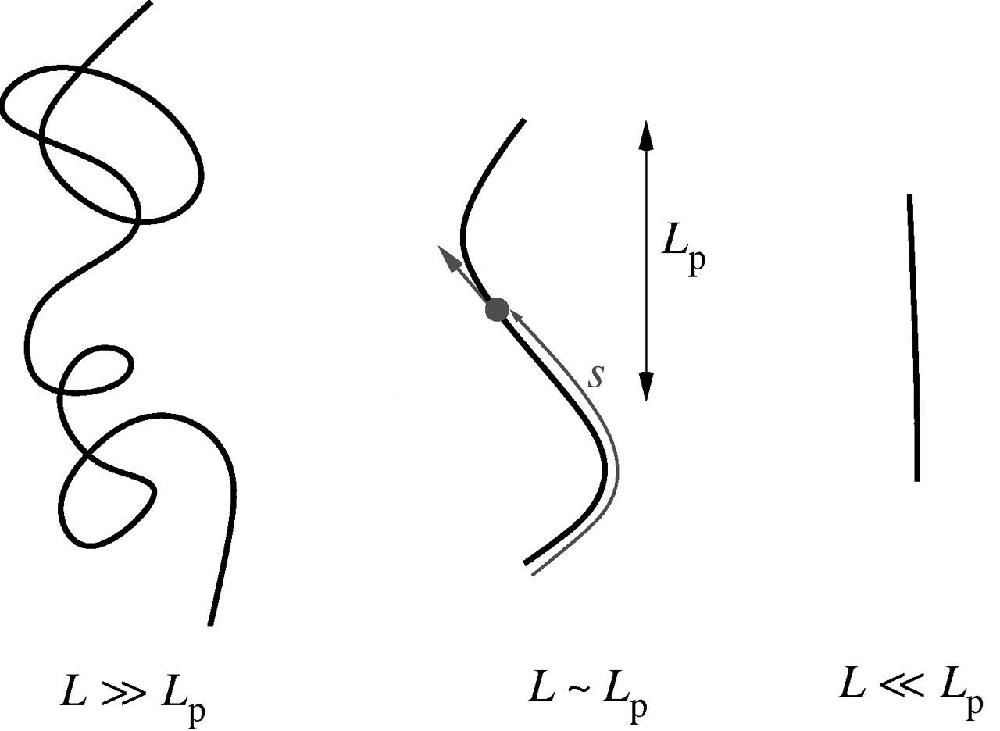

Preamble
########
.. 1

During my PhD I decided to investigate the effect of actin network on the
mechanical properties of cells. Indeed, mechanical properties of cell are a key
parameter that has a crucial impact on cell and organism function. Being able
to detect changes in mechanical properties, and understand the mechanism that
govern these changes  is an important step to be able to apprehend the behavior
of cells, distinguish healthy cells and tissues from cancerous ones.
Understanding the mechanism as the origin of cell motion and change in shape is
also a decisive step in controlling cell behavior, and being able to prevent
cancer sells invasion and division without impairing healthy cells.

During the last three years, I decided to focus on biomimetic system and
establish characteristic of actin network. Actin is a highly conserved
component across the living domain, and it plays a major role in cells
mechanics. By interacting with a number of other component of the cell, actin
is able to form a various number of networks. It is on such networks, and in
controlled condition that I decided to focus my research. 

Along this dissertation we will mainly focus on three systems.

On the first one, we reconstitute an already observed actin network — the actin
cortex — on a biomimetic system, then show that from this network emanate a
second sparse actin network previously unseen, and characterize its mechanical
properties. We developed the idea that the effect of this second network cannot
be neglected in cell and investigate a few of the phenomenon it can be involved
in.

As the effect of such a sparse actin has not been demonstrated we decided to
investigate the effect of another sparse actin network on a living cell. In
collaboration with College de France, we studied the mechanical properties
inside mouse oocyte. We see in this system that actin related proteins have
hi-impact on the structure and the mechanics both of the cell and the actin
network in it. 

Characterizing the dynamics of a network in a living cell by controlling the
condition is complex.  To characterize the dynamics and properties of actin
networks on the effect of linkage between the actin-cortex and the cell
membrane, we developed a new biomimetic system. This system of "doublets" allow
to measure the variation of tensions generated by an acto-myosin cortex with
time. The doublet system is composed by a doublet of two liposomes covered by
an actin network. Imaging with Spinning disk microscopy, we are able to
reconstruct changes in the acto-myosin network and deduce the changes in its
properties from the change in geometry. 

.. todo:

    recap the organisation of the PhD

.. Part

Background
##########
.. 1

.. todo:

    Misc To say

        - Even in mitosis for big cell, actin is needed to assemble chromosomes :cite:`Lenart2005`
        - Rapid change in actin structure :cite:`Vasilev2012`, timing is also important (exposition to inomycine disrupt cortex functionality)
        - F-actin network capable of supporting mechanical load :cite:`Feric2013` 
        - Presence of f-Actin mesh work mesh size ~0.5µm :cite:`Feric2013` 
        - This actin network can wistand repetitive compression :cite:`Feric2013` 
        - F actin network might be linked to the lamin (a kind of IF) cortex around the nucleus :cite:`Feric2013` 
        - Such a network would only need to sustain a pressure on the order od 0.01 PA :cite:`Feric2013`,
          and is essential to fight against gravity

Introduction
************
.. 2

Cells are the basic component of living organisms. Understanding their
individual behavior and the way they function is a key step to understand
how they interact with their environment. One of the key components within most
cells is actin, a protein which is highly conserved across the species and plays
an important role for the cell mechanics, from cell migration to cell differentiation
and division. It plays also a non negligible role in mechanical properties of
the cell and its interactions with the environment. Under the cell membrane lies a 
thin actin layer which controls mechanical properties of the cell: 
the actin cortex. The mechanical behavior of this actin cortex is itself driven
by the dynamics and interactions of the actin network  it is made off.
Understanding this actin network is hence a key to learn how the actin
cortex behaves, leading to a better understanding of cells and tissues. 

The properties of an actin network highly depend on its structure. The
structure itself depends on many parameters that influenced how the network is
formed.  The network structure and formation is influence by physical and
chemical conditions. The spatial and temporal variation of these parameters like
stress and ion-concentration can determine the fate of a network. Hence it is though
important to study these networks and their dynamics in order to grasp the
changing structure of the cell.

Cells are complex systems that adapt their shape, mechanical properties and
biochemical conditions permanently. The spatial repartition of theses
properties is also variable as the cell regulates the concentration of proteins
all across its cytoplasm. To well study the effect of each component independently,
it is crucial to study actin networks in a controlled environment.

Biomimetic systems allow to respond to most of these concerns, they provide a
controlled environment that mimic `in-vivo` phenomenon. Biochemical conditions
can be well controlled, both in space and time allowing to precisely fine tune
experimental conditions. Biomimetic system are also particularly adapted to be combined with
optical traps which allow us to study local mechanical properties of actin
networks with a high time resolution. The combination of both allows us to get
insight into the variation of theses mechanical properties as a function of
time and space with a high precision. 

During my PhD,  I have focused on the study of the mechanics of branched actin
networks polymerizing on optically trapped polystyrene beads. Such networks where
studied before :cite:`Kawska2012` but have been suspected to be highly
inhomogeneous. Optical traps allowed to probe mechanics of parts of
the network which had been  unaccessible before.
I further studied actin
networks on other biomimetic systems constituted of liposomes, in order to better
understand the effect of actin cortex polymerisation on membrane tension and
characterize network dynamic over time. Finally,  I participated in a
collaboration in order to understand the implication such actin network in
living mouse oocytes.

.. :cite:`...`  

.. include:: cells.rst
.. include:: roleofactin.rst

In vitro reconstituted actin networks
*************************************
.. 2

Living cells are complex organisms, for which each function requires a number
of interacting proteins and components. To understand the action of each
individual component it is needed to isolate or modify their actions
independently.

In order to achieve the  precise tuning of each component independently two
approachs are envisageable. An approach referred to  as "Top-Down" where
starting from the full system — in our case the cell — we will modify or remove
each of the component and study the global change of behavior. This is a complex
process that might be difficult to interpret as biological systems have often
multiple pathways and feedback loop to regulate each of their processes. With the
large number of components that constitute a living cell, it is also relatively
difficult to come up with the minimal system necessary to replicate a behavior.

The other approach, also referred to as the  bottom-up approach, require to
reconstitute the system  component by component until it replicate the expected
behavior. It is also a complex process, as there are a large of component to
chose from that can potentially be added to the reconstituted system, but often
lead to a wider range for the testable parameter as well as minimal number of
interacting component. This allow for a deeper understanding of the governing
principle of the system, and often permits access to a wider range of accessible
conditions and individual tweaking of component.

In our lab we are mainly interested in the bottom-up approach and the use of
biomimetic system. We try to reconstitute biologically relevant behavior with
the minimal system constituted from pure protein components.

In particular in this manuscript we are interested in mimicking the motility process
by which the `listeria` pathogen is able to hijack cellular mechanisms, recruit proteins
responsible for actin polymerisation at the leading edge of the cell, and use
them to polymerize actin on its surface. This is what allows the listeria to
propel itself fast enough (1.5 to 2 µm /min) :cite:`Dabiri1990` to be able to
pass through cell membrane from one cell to the other.

The bead motility system is a minimal in-vitro system capable of replicating
the listeria motility.

.. _bead-motility-assay:

Bead motility assay
===================
.. 3

The `Listeria` pathogen is a 1.5 to 5 micrometer cylindrical bacteria that
enter cells, hijacks its actin polymerisation machinery to propel itself and
infect neighbour cells. It does so by the recruitment of a single protein its
surface : ActA, that activates the Arp2/3 complex. By the recruited of Arp2/3 a
dense branched and entangle actin network growth that will eventually form a
comet behind the bacteria propelling the bacteria at the speed of actin comet
polymerisation. Listeria comets are composed of a wide range of protein, it has
though been shown :cite:`Loisel1999` that the number of required component can
be highly reduced.

The simpler system that can replicate the listeria motility is the bead
motility assay, it consist of a micrometer-sized bead covered with a nucleation
promoting factor that will activate Arp2/3 present in solution.  This NPF can
be ActA as in the case of listeria, but one can use other NPF like N-WASp or
pVCA. In the experiments presented in this work  we use pVCA. The NPF covered
bead is in a G-Actin solution. Capping Protein is added to prevent
polymerisation from happening away from the bead surface as well as the
components necessary for actin polymerisation (ATP, Salt..., see :ref:`Material and methods <m_et_m>`) 

Due to the presence of Capping Protein in solution and NPF on the surface of
the bead, the polymerisation of actin will happened only on the surface on the
bead forming a thin and dens actin gel capable of sustaining stress depending
on on the different protein concentration. Unlike in the case of listeria which
control on which of its side the nucleation process happens, this is not
controlled on bead motility assay. Though, in the right condition
:cite:`Kawska2012` the dense actin gel formed on the bead surface can
accumulate stress induce by polymerisation of inner layer until symmetry
breaking occurs. The gels ruptures on one of the side of the bead, leading to
the formation of a comet on the opposite side.

.. figure:: /figs/Plastino-Sykes-2005.png 
    :width: 60% 
    
    Scheme of bead motility assay. The NPF (yellow stars) will localize the
    actin polymerisation on the surface of the bead thus increasing stress on
    the outer actin layers. At a sufficient level of stress, the outer layer
    ruptures, leading to symmetry breaking, formation of a comet, and
    propulsion of the bead. Adapted from :cite:`Plastino2005`

The further polymerisation of the actin network on the surface of the bead will
make the comet grow, propelling the bead forward. This is what makes the bead
system a biomimetic system replicating the listeria motion.

It should be noted that during the movement of this system, two phases can be
distinguished. In the first phase, the system present a spherical symmetry with
an homogeneous actin  network around the bead. The gel is growing from the
surface and is accumulating stress due to the polymerisation of inner layers.

If the gel to able of accumulate sufficient stress, by polymerisation,  the symmetry breaking event happens, and the system enters in
a second phase with the formation of a comet. 

The condition that lead to symmetry breaking are investigated in
:cite:`Kawska2012`. In the absence of Capping Protein, the actin polymerisation seem
not to be restricted enough near the surface of the bead, and the formed
network is not able to generate or sustain enough stress to achieve symmetry
breaking. At high Capping Protein concentration, the growth of the gel is too impaired
to also permit symmetry breaking. The concentration of Arp2/3 is also critical
as Arp2/3 form branched network, and these branched network are primordial for the
ability to sustain stress.

.. _phase-diag:

.. figure:: /figs/symmetry-breaking-phase-diagram.png
    :alt: Symetry breaking phase diagram
    :width: 70% 

    Phase diagram showing symmetry breaking in bead motility assay as a
    function of concentration of Arp2/3 and Capping Protein. Symmetry breaking
    only occurs inside the area delimited by dashed line. Experiments are
    displayed as inverted fluorescence image. Adapted from :cite:`Kawska2012`

In the rest of this manuscript we use the bead motility system but only
consider it during the first phase, where the symmetry breaking has not yet
occurred, or in condition where it should not occur. In particular we will
investigate condition at 25 nM Arp2/3 and concentration of Capping Protein
varying from 0 to 50 nM. This correspond in :num:`Fig #phase-diag` to both
condition where no symmetry breaking can occurs, but also to condition in which
symmetry breaks with the highest probability.  It should be noted that unlike
other study that also characterize actin network growing on bead
:cite:`Pujol2012`, our system is still dynamically polymerising and thus
changing with time.

 
.. This first phase where the gel is still
.. homogeneous around the bead has already been studied in :cite:`Pujol2012`, who
.. measure the stiffness of the thin actin gels that form near the surface of the
.. bead.

.. We focus on fixed system where we will do further study on still
.. polymerising system.

.. todo:

     - bead assay
       - when it was designed
       - mimic listeria motility 

       - nucleation on the surface by Arp2/3 NPF, both mimicking the
         nucleation at the membrane outside of bacteria (listeria) and inside
         cell. 
     - controlled biochemical condition 
     - bottom up approach  

Liposomes
=========
.. 3

Beads are used as model biomimetic system that replicate the polymerisation mechanism
happening on the leading edge of the cell. Because of their composition and
rigidity, phenomenon observed on beads cannot necessarily reproduce all the interactions and
processes that take place on cell membrane. Cells are finite compartments with a
limited amount of actin that act on the dynamic of polymerisation.  The fact
that cell size is in the order of the persistence length of actin filaments
also play a role on the structure of actin network. Indeed at these scale as a
single filament can never reach the length at which is can be considers fully
flexible.

Liposomes are one of the biomimetic system that are capable of capturing some
interactions between cell membranes. Liposomes are lipid bilayers that imprison
an aqueous compartment and exhibit many characteristic similar to cells.
The inside of liposomes can act as a biochemical reactor of limited size with
the lipid bilayer actin as a separation to the outside, like the cell
membrane. The composition of the lipid layer can be varied in order to reflect
the composition of cell membrane. In particular it is possible to attach
proteins to the liposome membrane. Finally the size of the liposomes can be
varied, leading to actin networks of size and shape similar to those found in
cells.

It is possible to mimic the cellular actin cortex using liposomes, and especially
its contractility. A crosslinked actin network, can be formed and attached to
the outer leaflet of liposomes, and contractility can be trigged by injecting
molecular motors. The behavior of the system will depend on the attachment
between the reconstituted actin cortex and liposomes membrane.  Weak attachment
lead to a favorable rupture of the actin cortex during the increase of tension,
implying a symmetry breaking as in bead system.  In the case of strong
attachment the liposomes actin cortex will accumulate tension until it has
enough force to crush the supporting lipid layer thus collapsing the liposomes
:cite:`Carvalho2013`. This system also allow the observation of the system
through time giving extra insight into the dynamic of actin network.

.. figure:: /figs/joel-2-11.png
    :alt: Nothing
    :width: 80%

    Effect of reconstituted rigid actin cortex attachment to a liposome
    membrane under constraint generated by myosin filaments. On weak attachment
    the actin network ruptures thus leading to a "peeling" of the actin cortex.
    With stronger attachment the actin cortex can sustain higher stress, until
    the underlying liposome ruptures ("Crushing"). Adapted from
    :cite:`Carvalho2013`

.. figure:: /figs/joel-5-12.png
    :width: 90%

    3D reconstruction of an acto-myosin cortex (green actin) peeling on a
    liposome (red) through time (1.4 second between frames). The actin cortex
    contraction happened after the injection of Myosin II. Scale bar is 5 µm.
    Experiment and reconstruction done by Joël Lemière.

Membrane Physics 
****************
.. 2

The membrane of living cell is a complex, being the host a large number of
interacting proteins and lipids each with their own dynamics. Though at the
scale of cell and liposomes it is interest to model the membrane as a 2D surface
(that is to say without thickness) characterized by global mechanical properties.

In the case of closed lipid bilayers, the mechanical property we are interested
in resume to the expansion modulus :math:`K_a` and the bending modulus
:math:`K_b`. The value of theses two constant will vary depending on the
protein and lipid that are present in each of the two leaflet of the lipid
bilayer.

The expansion modulus :math:`K_a` express how much energy is required to
expand the surface of the lipid bilayer and is due to the exposition of more
hydrophobic surface to water when expanding it. :math:`K_a` is expressed in
:math:`J.m^{-2}`, or :math:`N/m` and is close to 2 time the surface tension between the
lipids and water.

Thus the formalism of surface tension is often used  as physical models in cell
and liposomes. This allow to link the difference of pressure between two side
of a membrane to the membrane tension and its curvature; also known as Laplace Law : 

.. math::
    \Delta P = \gamma \left(\frac{1}{R_1}+\frac{1}{R_2}\right)

Where :math:`{R_1}` and :math:`{R_2}` are the principal curvatures radius which
are equal in the case of sphere. This technique allow for the measure of tension on liposome or cortical tension of cell using aspiration :cite:`Chaigne2013a`, :cite:`Maitre2012`. 

.. figure:: /figs/Cell-Surface-tension.png
    :alt: nothing
    :width: 40%

    Surface tension govern doublet shape,  adapted from :cite:`Maitre2012`.
    The equilibrium of forces on the contact line govern the angle of contact
    :math:`2.\theta`. :math:`\omega` correspond to the adhesion tension between
    the two cells, :math:`\gamma_{cm}` correspond to the cortex tension between
    the cell and  the medium, :math:`\gamma_{cc}` correspond to the cortex
    tension between the two cells. 

When more than two regions of space are in contact with each other at the same
location, they form a contact line. The displacement of this contact line often
lead to the change of contact area between each region which makes the
reasoning on surface tension and energy difficult. Though the problem can be
reinterpreted by considering that each interface exerted a force on each unit
length of the contact line. The force exerted by each interface is proportional
to the surface tension of the interface and tangent to it on the contact line.
Most problem can thus be resolved by looking at the equilibrium of the contact
line and solve the condition for which the force on it equilibrate. In such
cases, the contact angle on the contact line is a key parameter in the relation
between each tensions. The measure of contact angle can be use to derive the
relation of cell membrane+cortex tension between cells in contact
:cite:`Maitre2012`

.. _viscoelastic:

Actin networks as viscoelastic material
***************************************
.. 2

We have seen previously that while polymerising, G-actin assembles into F-actin
filaments. The stiffness of filament can be measured by a characteristic number
called the persistence length (:math:`l_p`). More precisely, the
persistence length characterise the average loss of correlation between the
tangent along the considered polymer. With :math:`s` the curvilinear abscissae along the polymer, and :math:`\Theta_{(x,y)}` the angle between the two tangent at two different abscissae:

    Schematic of polymers with length respectively big compared to persistence
    length (A), in the order of the persistence length (B) and small compared
    to persistence length (C), :math:`s` as defined on (B) is the `curvilinear
    abscissae`, that is to say the distance between two point of the polymer
    measured by "following" the polymer. Adapted from :cite:`Liverpool2006`

.. math::
    \left<\Theta_{(s,s+l)}\right> = exp\left(\frac{-l}{l_p}\right)

For actin filaments, the
persistence length is in the order of 10 µm :cite:`Isambert1995`. This means
that for scales much smaller, the actin filament can be considered as rigid.
This is the case in the cell cortex where the meshwork has a typical size smaller than 250 nm. In
the other extreme, at length scale much bigger than :math:`l_p`, filaments can
be considered as flexible. While in typical cells, the cell size is
rarely much bigger than the persistence length of actin, `Xenopus` eggs can be
as big as 1 mm, so hundreds fold the actin persistence length.
Still for the majority of cells, the typical size we are interested in
is about the persistence length of an actin filament, making it neither purely
rigid nor completely flexible.

For the above reasons, actin solutions are often compared to semi-flexible
polymers, and models that predict the behavior of actin networks often take
foundation on polymers physics :cite:`Morse1998b` :cite:`Morse1998a`. Still, if
theses models rely on local microscopic parameter, experimental methods only
have access to bulk properties of the studied material, and it is from theses
properties, and through the models that we can deduce possible values for the
microscopic models :cite:`MacKintosh1995`. 

.. _elastic_modulus:

Elastics Modulus
================
.. 3

The elastics moduli are probably the easiest to understand. They are
a characteristic of how a material will deform non permanently under an applied
force. The stiffer something is the higher its elastics moduli will be. There
are two specific elastic moduli of interest in this
manuscript, `Young's Modulus` and `shear modulus`. The first one describes how a material will react to compression or extension, while the
second describes how a material resists  shearing. For isotropic and homogeneous
material, the Young's modulus (E) and the shear models (G) are related
by the Poisson ratio (:math:`\nu`):

.. math::
    
    G = \frac{E}{2(1+\nu)}

Both G and E units are homogeneous to :math:`N/m^2` or
:math:`Pa`.  It is interesting to have an idea of the oder of magnitude of a
few usual materials. Aluminum will have an elastic modulus :math:`G_{Al}\simeq
70~GPa` while rubber will be more in the order of :math:`G_{rubber}\simeq
0.1~GPa`. The elastic modulus of muscle cell is in the order of
:math:`G_{muscle} \sim 10~kPa` and brain tissues around :math:`G_{brain} \sim
0.1~\text{to}~1~kPa` :cite:`Engler2006`.

A  more formal definition of the Young's modulus, is the ratio between
the stress :math:`\sigma` along the direction of the deformation and the relative deformation :math:`\epsilon`. 

.. math:: 
    
    E &= \frac{\sigma}{\epsilon} \\
      & = \frac{   F/S }{   \Delta L / L_0        }

In which :math:`F` is the applied force, :math:`S` is the cross section of the
material, :math:`\Delta L` is the elongation and :math:`L_0` is the initial
length of the considered material.  (:num:`Figure #fym`):

.. _fym:
.. figure:: /figs/youngm.png
    :width: 50%
    :alt: Definition of young modulus
    
    Schematic of Young Modulus definition. F, force applied to sample, S
    surface of cross section when uncompressed, :math:`L_0`, length when no load
    applied. For both compression and extension, in the regime of small
    deformation, the relative change of length is proportional to the applied
    force. Here, the material can be seen to expand/contract in the direction
    orthogonal to the direction of application of the force, in the case of an
    incompressible material (:math:`\nu \neq 0.5`) this con be seen as the
    conservation of volume of the material.

The shear modulus is defined for a deformation parallel to the surface on which it is applied :

.. math::

   G &= \frac{\tau_{xy}}{\gamma_{xy}} \\
      & = \frac{   F/S }{   \Delta x / l        }

.. _fgm:
.. figure:: /figs/shearm.png
    :width: 50%

    Schematic of deformation for the shear modulus.

In which :math:`\tau_{xy}` is the shear stress, :math:`\gamma_{xy}` is the shear strain, :math:`F` is the applied force on the cross section of the material :math:`S`. :math:`l` is the thickness of the material and :math:`\Delta x` is the transverse displacement (:num:`Fig #fgm`).

Other characteristic numbers can also be defined. In the case of isotropic
elastic material, only two of those parameter are required to completely define
the properties of the material. 

Poisson Ratio
=============
.. 3

We have just seen that the shear modulus is linked to the Young modulus using
the Poisson ratio.  The Poisson ration is another characteristic of a material
that define how much a material will compress/expand in the directions
orthogonal to its elongation.

Poisson ratio is the negative ratio of transverse to axial strain :

.. math::

    \nu = - \frac{
        d \epsilon_{trans}
    }{
        d \epsilon_{axial}
    }

In which :math:`\epsilon_{axial}` is the relative deformation along one the
axis of compression/elongation and :math:`\epsilon_{trans}` correspond to the
relative deformation along an axis orthogonal to the axis of deformation.

Having volume conservation of material during compression or elongation require
a Poisson ratio of `0.5`. Such value have been found in bulk measurements of
actin network at 21.5 µM of actin :cite:`Gardel2003`. Material with a Poisson ratio of `0.5` are
said to be incompressible. A Poisson ratio lower `0.5` correspond to material
expanding less than incompressible materials, some cell and tissues are known to
have Poisson ratio lower than 0.5 :cite:`Mahaffy2004`. Another critical value
is 0, at which the material only expand or contract in the direction of the
main stress.

Material with a Poisson ratio superior to 0.5 would show a bigger
deformation in the orthogonal direction than incompressible material, leading
to a global increase of volume if compressed. 

Viscosity
=========
.. 3

Like elasticity, viscosity is something tangible we are used to work with in
everyday life. The more viscous a material is the more difficult it is to move
something in it at high speed. And indeed, viscosity is the pendant of the elastic
modulus but considering forces induced by deformation rate instead of displacement.

.. math::

    F = S.\eta \frac{\partial v}{\partial z}

In which :math:`F` is the force exerted on the surface :math:`S`. :math:`\eta`
is the viscosity, and is expressed in :math:`Pa.s`, :math:`v` is the
deformation rate along the direction :math:`z` .

.. We will
.. also note that viscosity is often written :math:`\mu`, and can
.. also while dividing by the fluid density (:math:`\rho`)  then being :math:`\nu = {\eta}/{\rho}`.

At room temperature water has a viscosity of around 1 mPa.s, and honey of 10 Pa.s. The consideration of viscosity in problems will
often depend on the timescale and deformation rate. At short
timescale tissues often behaves elastically, whereas at long timescale the effect
of viscosity will be seen :cite:`Thoumine1997`. In actin network, the effect of
viscosity at short time scale can be as high as elasticity :cite:`Gardel`. 

.. todo:

    Relatively short, compare to E/G but for speed, value of viscosity for
    different fluid ?  Quick reynolds equation ? In the condition we are interested
    in we are at extremely low reynolds, so no intertia involved ?

.. todo:

    some value for tissues. Existence of  negative PR
    material we put everything in G, make it complex define the real and imaginary
    part as G' g'' 

Viscoelastic
============
.. 3

Typically, no material is purely elastic or purely viscous. While glaciers 
seem purely solid at the time scale of a few days, observation on longer time
scale ranging from month to years how that ice is not only a
solid but can also flow. Of course ice in its solid form is not the only
material which is both solid and viscous. In order to describe such
behavior one needs the theory of viscoelastic materials.  A number of models have
been and are still developed to describe viscoelastic behavior. The
Kelvin-Voigt and Maxwell models are two of the simpler ones. A thought
experiment to understand each of these model is to put a spring and a dash pot
in parallel or series. Such model systems will have a viscoelastic behavior. 

.. figure:: /figs/MKV.png
    :width: 70%    

    Maxwell model schematic on the left and Kelvin-Voigt model on the right.
    Both are a simple approach to express the properties of a viscoelastic
    solid. The response to a creep compliance will differ in both case. The Maxwell
    model will mostly behave like  a fluid with viscosity :math:`\eta` after a
    long time, where the Kelvin-Voigt model will mostly reflect the elastic
    component at constant stress exerted. (Schematic in Public Domain, adapted
    from Wikimedia).

The idea for more complex models is similar, where any material can be seen like an
(infinite) combination of springs (for elasticity), and dash-pots, (for viscosity).

The generalised model can then be described using a unique parameter, we extend
the shear modulus with a imaginary part (becoming :math:`G^*`), thus capturing the effect of
viscosity. In addition to an imaginary part, we introduce a dependency of `G`
with a pulsation (:math:`\omega`).

The real and imaginary part of :math:`G^*` are respectively called storage
(:math:`G'`) and loss (:math:`G"`) modulus.  We can then write the following :
   
.. math::
    G^*(\omega) = G' (\omega) + i.G"(\omega)

Where :math:`i` is the imaginary unit.  The star denoting the complex character
of `G` can be dropped, as well as the explicit dependency with :math:`\omega`.
The viscoelastic properties of a material are fully characterized by the full
expression for the storage and loss modulus as a function of the frequencies.

Models for actin network of different concentration under different hypotheses
have been extensively studied, and exhibit characteristic behavior for linear :cite:`Morse1998a`, and non linear :cite:`Yao2011` regimes.

.. Active and Passive microrheology 
.. *********************************
.. 2

Optical tweezer
***************
.. 2

Optical tweezers, or optical traps are a technique that allows to trap object
near the focal plane of a microscope at the focal point of a high power laser.
It is a versatile technique that allows to trap both fabricated objects and
part of living cell. Optical traps allow to apply force up to a few tenth of
pico newtons. 

To understand that light can trap an object, it is instructive to keep in mind
that despite having no mass, photons carry momentum, and as for any massive
object, changing the trajectory requires a force.  According to Newton third
law, when applying a force with a photon on a object, the object will in turn
exert the opposite force on the photon, thus changing the trajectory of the
photon. Thus if a photon changes trajectory in a material, the material apply a
force on the photon (:num:`Fig #setup`), meaning that the photon also apply a force on the
material. In particular, the higher the refractive index of a material is, the
more light beams are deviated, and hence the more photon apply forces on
material.

In particular, it can be shown that this leads object with higher refractive
index than surrounding medium to be attracted by toward higher light intensity
(:num:`Fig #setup`).  In parallel laser beams, with a Gaussian intensity
profile, this will lead to the object being attracted toward the center of the
beam. 

In addition to the lateral trapping, laser focus lead to
another intensity gradient along the direction of propagation of the
beam, the intensity being at its maximum at the laser waist. 

A laser coupled into a microscope objective then act as a three dimensional
potential that traps particle similar to a tweezer. Usually the trapping in
parallel to the direction of the laser is week compared to the trapping in the
perpendicular directions.

.. It should be noted that if trapped particles are hold strongly near the laser
.. focus, this does prevent the laser from exerting force on surrounding
.. particles, usually slowly attracting floating object passing in the converging
.. beam of light toward the plane of observation. The light also having a non
.. negligible radiation  pressure, object in the second half cone of diverging
.. light beyond the observation plane are often repel away from the trap.

.. _setup:
.. figure:: /figs/ot1.png
    :alt: schematic of setup plus one
    :width: 70%

    Deflected light by a transparent bead change the momentum of light, so the
    light is exerting a force on the bead. The bead will be attracted towards
    the highest intensity.  For a focused laser beam, the bead will be attracted
    near the focus of the laser.

One of the quality of optical trap is that in principle, multiple traps can be
obtained. A simple method to generate two traps is to split the incoming light
into two orthogonally polarized independent beams.  Instead of sharing the
laser power between the different traps by using polarisation, one can use what
is known as multiplexing by time sharing. By switching the laser rapidly
between different positions at a much faster the diffusion of trapped particle
out of the trap,  one is able to virtually achieve multiple traps on the same
sample. 

In our case, the rapid switching is achieved using Accousto Optic Deflector
(aka AODs).  AOD consists of a crystal in which a high frequency
sound-wave propagate. This sound-wave generates local changes in the
refractive index of the material which act as a diffraction grating. In
the right conditions, a laser passing through the crystal will
be deflected by this grating.

In practice, rapidly controlling the frequency and amplitude of the sound wave
in the crystal, allows direct adjustment of laser deflection and hence the
trap position.  Using AODs also has the advantage of controlin not only
of number and position of multiple traps, but also the individual power
allocated to each trap and hence the stiffness of relevant trap.

.. _ots:

.. figure:: /figs/setup-plus-1.png
    :alt: schematic of setup plus one
    :width: 90%

    A schematic of  setup used. The following elements can be distinguished. An
    1064nm laser is used for trapping. It first passes through two AODs that
    move the position of the trap in the X  and Y direction.  The first couple
    of lenses (L1,L2) between AODs assure that AODs are in conjugated planes.
    The second pair of lens (L3,L4) imaged the AODs plane in back-focal plane
    of the first objective.
    Thus a change of angle of the light beam induce by the AOD 
    result in a  change of position of the trap.  The trapping light
    is collected by a second objective, and illuminating a Quadrant photodiode
    (QPD) conjugated with the back focal plane of the collecting objective. By
    construction QPD and AODs should be conjugated, so deviation of the light
    beam induced by one of the AODs is not supposed to induce any change of
    position of the laser spot on the QPD. Additional dichroic mirrors allow to
    use bright field and epifluorescence simultaneously optical
    tweezer.

Determination of force and displacement on bead
===============================================
.. 3

In addition to allowing the objects to be hold in place, the use of a QDP
(Quadrant Photo Diode) with  optical trap have the advantaged of allowing the
high frequency quantitative measurement of the displacement and force exerted
on a object. 
Indeed, when the trapped particle is not in the trap center, 
the laser apply a force on the object.
Reciprocally the object apply the opposite force on the light beam,
thus deflecting the light beam.
Using optics and lenses correctly placed on the Fourier plane of the sample, it is
hence possible to translate this change of orientation of the light  beam into
a displacement of a light spot onto a photo detector with hight sensitivity to
applied forces.

Through careful calibration of the trap, that give the force/displacement
relationship, :cite:`Jahnel2011`, :cite:`Vermeulen2006`, one can then also
recover the displacement of the sample inside the optical trap.

Using optical tweezer to not only hold a particle in position, but also get
quantitative measurement of its displacement and force exerted require
calibrated probe. The use of polystyrene beads is one of the artificial probe
that can be use to achieve such a goal.

The use of polystyrene bead has multiple advantages, the first being that one
can obtain mono-dispersed bead leading to reproducible and predictable trap
stiffness. Secondly theory  can predict the shape of
the potential felt by such a bead in a Gaussian beam :cite:`Nieminen2007`.

.. .. figure:: /figs/bead_potential.png
..     :width: 100%
..     :alt: potential felt by a bead and force felt.
.. 
..     Left : scheme representing the potential felt by a bead along one axis,
..     near the minimum of the potential it can be approximated as an harmonic
..     potential, which correspond to a constant stiffness. Right: Deflection of
..     the light by an off centered bead in the trap. Also proportional to the
..     displacement of the spot on the QPD. With correct calibration of the trap
..     the displacement is also proportional the force exerted on the bead.
    
The third advantage being that beads can be functionalized, allowing specific
interaction to be controlled, both in vitro and in vivo. Of course, the
calibration is essential for the correct measurement of mechanical property of
different system, and the choice of the bead diameter have impact both on
biological side and in the physics of the measurement. 

.. In particular, the
.. linear regime for the  displacement-deflection can only be seen for beads that have a
.. diameter which is not too close from the beam waist diameter. In such case a
.. flattening on the curve prevent precise measurement.

.. figure: /figs/todo.png
    :width: 80%
    :alt: flattening of the displacement/deflection curve

..    Simulation of flattening of the curve near the center of the trap by
..    deriving the sum of two gaussians. One cannot make a linear approximation
..    near the center.

