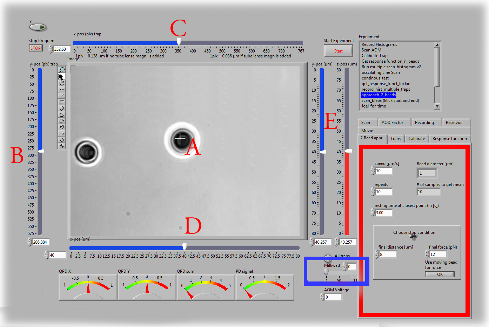

.. part2

.. _m_et_m:
Materials and Methods
#####################
.. 1

Buffers
*******
.. 2

G-Buffer
========
.. 3

G-Buffer is used to conserve actin in the monomeric form. Actin is diluted in
G-Buffer and kept on ice for at least 12 hours before further use. G-buffer is
aliquoted and stored at -20°C. For weekly use or is thawed and conserved on ice for up to a week. G-buffer is never
refrozen.  pH is adjusted between 7 and 8.

Composition of G-Buffer:
     
    - 0.2 mM :math:`CaCl_2`
    - 0.5 mM DTT (Dithiothreitol, or (2S,3S)-1,4-bis(sulfanyl)butane-2,3-diol)
    - 2.0 mM Tris (tris(hydroxymethyl)aminomethane or 2-Amino-2-hydroxymethyl-propan)
    - 0.2 µM ATP (Adenosine triphosphate)

Polymerisation Buffer
=====================
.. 3

Polymerisation buffer or X-Buffer is used for polymerisation of actin gels on
beads  as well as bead dilution and cleaning buffer.  It is aliquoted and conserved at
-20°C. During experiments it is stored on ice for up to a week. X-Buffer is never
refrozen.

Composition of X-Buffer :

    - 10 mM Hepes (2-[4-(2-hydroxyethyl)piperazin-1-yl]ethanesulfonic acid)
    - 0.1 M :math:`KCl`
    - 1 mM :math:`MgCl_2`
    - 1 mM ATP (Adenosine triphosphate)
    - 0.1 mM :math:`CaCl2`

X-Buffer with BSA
=================
.. 3

Same as X-Buffer with the addition of 1% BSA (10 mg/ml). BSA is used to prevent
non specific adsorption. X-BSA buffer is used  in place of X-Buffer for
the conservation of the probe beads.

.. _atp_mix_buffer:

ATP-Mix Buffer
==============
.. 3

ATP-Mix buffer or simply `Mix` contains the ATP necessary for actin
polymerisation. It is aliquoted and stored at -20°C. Kept on ice for weekly use. pH is adjusted between 7.5 and 8.0.

    - 12.0 mM ATP,
    - 20,0 mM DDT
    - 0.88 mM Dabco
    - 24.0 mM :math:`MgCl_2` 

.. todo:
    Echange Actine ?

Protein preparation
*******************
.. 2

pWA (also called pVCA)
======================

pWA is use as a nucleation promoting factor. It is expressed from Human pVCA
(verprolin homology central and acidic domain) and expressed into Rosetta
2(DE3) pLysS (Novagen) Cell.  Purified pWA is aliquoted and conserved at -80°C, never
refrozen, and conserved on ice for daily use.

Actin
=====
.. 3

Actin and biotinylated actin are purchased from Cytoskeleton (Denver, CO, USA), and stored at -80°C.
Fluorescent Alexa-488 actin is obtained from Molecular Probes, stored at -80°C, and prepared according to manufacturer recommendation.

Actin is stored in aliquots of 5µL at a concentration of ~238 µM, and
fluorescent actin in aliquots of 3µL with a concentration of ~106 µM.

G-actin with 20% fluorescently labeled actin monomers is prepared the day before
the experiment by mixing 1 aliquot of actin with 1 aliquot of fluorescently
labeled actin and diluting the mix with G-Buffer until desired the concentration is reached.

Profilin
=========
.. 3

Human profilin is expressed by competent cells and purified in our laboratory as
described in :cite:`Carvalho2013a`.  Profilin is conserved at 4°C for a few month and
keep on ice for daily use.
    

.. Wild-type human profilin in pMW expression vector is transformed into Rosetta
.. 2(DE3) pLysS and expressed in 2 l of LB plus antibiotics overnight at 308C with
.. 1 mM isopropyl thiogalac- topyranoside (IPTG). Cells are lysed and sonicated in
.. 50mM Tris-Cl pH 7.5, 50 mM sucrose, 10 mM EDTA, 5 mM DTT, 1 mM
.. phenylmethanesulfonylfluoride (PMSF), 2 M urea and complete EDTA-free protease
.. inhibitor cocktail (Roche), then centrifuged at 100 000g for 1 h. Supernatants
.. are collected and bound to DEAE- 52 cellulose beads for 1 h. Flow through
.. containing profilin is dia- lyzed against 20 mM Tris-Cl pH 8.0, 20 mM KCl, 1 mM
.. EDTA and centrifuged for 20 min at 100 000g. Supernatants are filtered through
.. a 0.2 mm filter and purified by size exclusion over a HiPrep 16/60 Sephacryl
.. S-200 HR column in the dialysis buffer. Profilin is collected and again
.. purified over the Superdex 75 column in the same buffer. Profilin is stored at
.. 4°C.

Arp2/3
======
.. 3

Bovine Arp2/3 complex  from Bovine is purchased from Cytoskeleton prepared as recommended by the manufacturer, aliquoted at 1µM
and conserved at -80°C.  Aliquots are never refrozen and stored on ice for
weekly used.

.. cf :cite:`Foley`

Capping protein
=================
.. 3

Mouse capping protein (CP; a1/b2) is purified as previously described in :cite:`Soeno1998`. CP was a gift from Laurent Blanchoin.

Myosin II
=========
.. 3

Myosin II is purified from rabbit skeletal muscle, and fluorescent myosin II is
prepared as previously described in :cite:`SoareseSilva2011`. Functionality of
Myosin II is confirmed by motility assays. Gliding speed shows an average of 4.5
+ 1.5 µm/s (N = 27).

The working buffer for Myosin contains 

    - 25 mM imidazole
    - 50 mM KCl
    - 70 mM sucrose
    - 1mM Tris
    - 2 mM MgCl2
    - 1 mM ATP
    - 0.1 mM DTT
    - 0.02 mg/ml β-casein,

then adjusted to a pH  of 7.4.
In the working buffer myosin II
forms minifilaments of approximately 0.7 µm length which correspond to about 100
motors. 

Lipids, reagent and proteins
****************************
.. 2

Chemicals are purchased from Sigma Aldricht (St-Louis, Mo, USA) unless stated otherwise. 
EPC (l-:math:`\alpha`-phosphatidylcholine) and `1,2-distearoyl-sn-glycero-3-phosphoethanolamine-N-[biotinyl polyethylene glycol 2000]` 
(biotinylated lipids), `1,2-dioleoyl-sn-glycero-3-phosphocholine` are purchased from Avanti polar lipids (Alabaster, USA).
Monomeric actin containing 10% or 20% of labeled Alexa-488
actin and 0.25 % of biotinylated actin is diluted in G-Buffer 

.. _electroformation:

Doublet preparation
********************
.. 2

Cell-sized liposomes are formed by electro formation :cite:`Angelova1986`.
20 µL mix of EPC lipids and PEG-biotin lipids (present at 0.1 %, mol ) with a
concentration of 2.5 mg/ml in chloroform/methanol 5:3 are deposited on glass
plates coated with  ITO. Glass is then dried with  nitrogen; placed
under vacuum for 2 hours.

A chamber is formed using the ITO plates with their conductive sides facing
inside, then filled with sucrose buffer (200mM sucrose, 2mM Tris adjusted at pH
7.4). Chamber is sealed with with hematocrit paste (Vitrex medical, Denmark).

An alternate current voltage of 1V at 10 Hz is applied between the ITO-coated
surfaces for 75minutes to form liposomes.

The same preparation is done a second time by adding 0.9µm sulphorhodamin to
the sucrose buffer in order to mark liposomes inside buffer fluorescently.

The two solution are mixed in order to have the inside buffer of half the
liposome marked in red and being able to distinguish the interfaced in some of
the formed doublets.

Formed liposomes are incubated 15 minutes with 160 nM streptavidin in order to
coat them with streptavidin. Liposomes coated with streptavidin tend to
aggregates.  The solution containing doublets is then diluted 30 times. Waiting
15 minutes increase the ratio doublets/single liposome by still avoiding
aggregates of more liposome.

A bulk solution of 40 µM actin monomers — 10% fluo and 0.25% biotinylated — is
diluted 40 times in working buffer (25 mM imidazole, 50 mM KCl, 70 mM sucrose,
1mM Tris, 2 mM MgCl2, 1 mM ATP, 0.1 mM DTT, 0.02 mg/ml β-casein, adjusted at a
pH 7.4) and polymerized for one hour. The adjunction of 1 µm of phalloidin
after 1 hour prevent further depolymerisation

Actin filaments are 
diluted to 0.1 µM (10x), mixed with streptavidin-coated doublets of
liposomes, and incubated for 15 min. The mix is diluted 5 times to reduce fluorescent background form actin monomers in solution. 

.. _bead_preparation:

Bead Preparation
****************
.. 2

Carboxylated polystyrene beads (Polysciences, Philadelphia, PA) of 4.34 ± 0.239
μm (Standard deviation) diameter were used as actin-bead and probe-beads.

Beads are stored at 4°C.

Before coating by BSA (probe bead) or pWA (actin-bead), bead solution is
cleaned by centrifugation at 5000 rpm, 2min. Supernatant is removed, and pellet
is resuspended in X-Buffer. This procedure is repeated twice.

Actin-Bead Preparation 
=======================
.. 3

Cleaned polystyrene beads are incubated for 20 min at 20°C under agitation with
2 μM pVCA. Centrifuged at 5000rpm 2min, supernatant is removed and pellet
diluted 4 times in X-buffer. The beads are stored on ice for the day.

Probe Bead Preparation
======================
.. 3

Cleaned polystyrene beads are incubated under agitation with 10 mg/ml BSA at
room temperature for 30 minutes. Passivated beads are then centrifuged,
separated from supernatant, and the pellet is resuspended in X-BSA buffer and
stored at 4°C for weekly use.

.. _force-indentation-experiments:

Force indentation experiments
*****************************
.. 2

Preparation of sample 
======================
.. 3

Equal amount of each actin and probe beads are placed in the polymerization
mix consisting of : 

    - 2µL BSA at 10%
    - 3µL of ATP-Mix Buffer
    - 1.5 µL Profilin (114µM)
    - 1 µL beads (50% actin-bead 50% probe bead)
    - 0.5 µL Arp2/3 (22,3 µM)
    - between 0 and 2 µL CP (0.5 µM)
    - Completed to 15 µL using X-Buffer.

.. Todo::
    There are XX letters in the concentration for VaLaP, please fill in.

5 µL of G-Actin (20% fluorescent) is then added to the previous mix. This
moment parks the time `t=0` for the experiment and recording. The experimental chamber is
build by 2 coverslips that are separated by VaLaP. VaLaP is a mix of vaseline (33%)
Lanoline (33%) and Parafine(33%) in equal mass proportion. The chamber is prepared by gently depositing 20 µL of
the final beads mix at the center of the lower coverslip and 4 drops of VaLaP
are deposited at the position where the corner of the upper (18x18mm) coverslip
will rest. The VaLaP acts as a spacer and prevents the sample to be squashed.  The
upper coverslip is then placed on top of the sample and the chamber is sealed
using VaLaP.

.. _laser_calibration:

QPD positioning and calibration of microscope
=============================================
.. 3

The prepared sample is placed on the microscope and a drop of water is
deposited on top of the upper coverslip to assure immersion of the light
collecting objective. The collecting objective and the quadrant photodiode are
place on top of the sample (:num:`Fig #ots-2`).

.. _ots-2:
.. figure:: /figs/setup-plus-1.png
    :alt: schematic of setup plus one
    :width: 60%

    Schematic of experimental setup. The QPD situated after the collector allows
    to determine the displacement between the laser focus and the bead, which is used in combination with the 
    predetermined trap stiffness to calculate the force exerted on the trapped sample. It needs to be
    correctly positioned before each experiment.    

The trapping laser is then aligned with the photodiode while verifying that no
object is trapped during the process. The conjugation of the back focal plane
of the objective with the AODs and the QPD is optimized by adjusting the
distance of both objectives with respect to the sample. 

A trapping laser is positioned near the center of the microscope field of view
using the custom written LabView program. The QPD is adjusted in X and Y direction to
:math:`\Delta X  = \Delta Y = 0V`. This is done while no object trapped in
the  laser focus.

Initial bead trapping
=====================
.. 3

Two maximum strength trap (~50mW/trap) are created near the center of the
microscope field of view, separated by 15 to 20 µm. The sample plane is the then moved in
the Z-direction by displacing the 3D piezo controlled sample stage to position the traps 
near the middle plane of the chamber. Temporarily removing the Infra Red filter (:num:`Fig #ots-2`)
from the microscope allows to see the reflection of the trapping lasers on the
upper and lower coverslip and to determine the localisation of the middle plane
of the observation chamber.

    Software interface responsible for controlling the optical tweezer.  Sample
    image showing 2 polystyrene beads and a single trap (A, white cross) holding one bead.
    Cursors (B,C) are available to displace the optical trap(s).  Cursors can
    control the position of the stage is X (D), Y (E, blue) and Z (E,red).
    The blue rectangle highlights the slider that allows to control the trap power.  The red
    rectangle highlights the area where the different parameters of the experiment
    can be set (approach speed, resting time at closest point). 3 indicators at
    the bottom of the screen indicate the voltage on the QPD.

The operator then captures one probe-bead and one actin-bead in each of the
traps.  Both types of beads can be recognized using fluorescent microscopy, as
actin-beads are promptly cover with a fluorescent actin 
which  can clearly be distinguished from the probe bead that remains dark.
In the case where two identical beads are trapped one of the two traps can selectively
be disabled or decreased in stiffness, letting the bead escape from  the trap,
and the procedure can be repeated.

The operator will then move the two traps roughly one micrometer in each
direction to check that the two beads are effectively trapped in the tweezer and
that no external forces act on the beads. 

.. Finally the operator verify that the two trap are aligned along one of the
.. principal axis of the AODs to avoid the "ghost trap" phenomenon. 

For practical reasons, the traps are aligned along one of the principles axis
of the AOD before starting the indentation experiments.

Indentations
============
.. 3

The operator sets the parameters of the experiment in the software: 

    - Average bead radius, 
    - Approach/Retraction Speed.
    - Resting Time
    - Laser Power

For each pair of actin/probe bead, the initial minimum approach distance of the
traps is set to 5 to 8 µm before a single indentation cycle is done. If the
maximum measured force between the two beads is not higher than 8 to 10 pN, the
minimum approach distance is reduced by 0.25 to 1 µm and the procedure
repeated. Once the maximum force measured is in the 10-15pN range the right
distance is found and up to 10 automatic force-indentation experiments are
performed. Before each indentation the software automatically does a "scan" of
each bead to ensure correct calibration. An indentation cycle has the
following step: 

    - Probe trap is approaching the actin-bead at constant speed until the minimal approach distance has been reached.
    - At the minimal distance the traps remain stationary for the predefined (typical 3 seconds) resting time.
    - Probe trap returns to its initial position at constant speed.
    - Cycle is repeated as many times as set.

During this cycle the deflection of the laser induced by the probe-bead and
actin-bead are recored by the QPD.

After an indentation cycle is finished the experimenter can try to perform the
indentation on the actin-bead from another direction, or release the actin-bead
proceeding to a new one.

In the case where the indented actin network shows signs of inhomogeneity or
symmetry breaking, the experiments are stopped and not taken into account for
further analysis.

The date and time of each indentation cycle is recorded to extract the time of
polymerisation for each sample.

.. _bead-move:

.. figure:: /figs/beed_move.png
    :alt: indent experiment
    :width: 50%

    Schematic of indentation experiment. On the left is the actin-bead, covered
    with actin, in the static trap, on the right the probe-bead in the mobile
    trap. At the beginning of the experiment (A) the probe bead is situated far from
    the actin-bead. During the approach phase (I) the moving trap approaches
    the static trap at 10µm/sec until it reaches the minimal approach
    distance (B). The moving trap stays at the minimal approach distance for
    3sec (II), which constitute the relaxation phase.C) The actin gel are
    relaxed, the distance between bead is smaller than on B. III) the moving
    trap retract at 10 µm/sec back to its initial position.

.. _time_shared_ot:

Time Shared Optical Traps
*************************
.. 2

The optical trap is build on an inverted microscope (Olympus, IX71) equipped with
a fluorescence (200W mercury lamp, Osram, Munich, Germany). The sample is observed
through a Olympus 60X water immersion objective (Olympus) with numerical aperture NA=1.2, that also
serves at entry point for the laser of the optical tweezer.  The light source is 
an infrared fiber laser (:math:`\lambda=1064nm`, YLP-1-1064, IPG,
Germany). X, Y positioning and stiffness of the trapping force are controlled
by 2 Acousto Optic Deflectors (AODs, AA-Optoelectronics, France) that are placed  in the conjugated plane of
the back focal plane of the objective. 
Multiple traps can be achieved by switching the laser between
multiple positions within a switching time in the order of 5 µs, and resting
on each position 20µs or more. 

.. The phenomenon of ghost trap can be avoid by automatically aligning the trap on
.. one of the AOD axis or decreasing the laser power to zero during each
.. transition but doubling the required transition between position time. 

Light refracted by the trapped sample is collected by a 40X (N.A:0.9, Olympus)
water immersion objective and imaged on a quadrant photodiode (QPD) conjugated
with the back focal plane of the light collection objective. Signals from the
QPD (:math:`\Delta X, \Delta Y` and :math:`\Sigma`) are sampled at 500kHz, by a Digital
To Analogic Aquisition card (NI PCIe-6363, National Instruments, Austin,
Texas), controlled using a custom written Labview software (National Instruments)
coupled with Matlab (Mathworks, Natick, MA). Raw signals are preprocessed by binning all 
voltage measured during the time the laser rest (typically 20µs) at one position. Finally
the mean and standard deviation for each trap visit is stored for further processing.

The trap stiffness is inferred from bead radius, laser power, number of present
traps and control experiment data. In control experiments the trap stiffness is
calibrated using the power spectral density method, and was determined
to be as high as 80 pN/µm at full laser power (119mW) for a single trap.
In the case of multiplexing two traps as used in this work, both traps were calibrated before
the experiment. 
Coarse positioning of the sample is done through a pair of micrometer precision
screws capable of translating the microscope stage in X and Y.  Finer
positioning in X,Y and Z direction are done with the help of a 3D piezo stage with an
accessible range of 80 µm in each direction and a sub-micrometer accuracy.  

Oocyte
******
.. 2

Oocyte obtention
================
.. 3

Oocyte culture, collection and micro injection where done at College de France by Maria Almonacid.

Oocytes were collected from 11 to 15 week old mice (WT), fmn2-/- as previously
described in :cite:`Holubcova2013` and maintained in Prophase I in M2+BSA
supplemented with  1µM Milrinone. Oocyte are then injected with cRNA  using a
micro-injector Eppendorf FemtoJet. Imaging was carried out at :math:`37^\circ{}C`.

.. Indentation experiment
.. **********************
.. 2

.. To determine the mechanical properties of an actin gel growing on bead as used
.. in motility assay, I used an indentation assay close to what can be done using
.. Atomic Force Microscopy. In this part I will describe the different choice I
.. made for the experiments parameters and the reason behind them. 
.. 
.. The indentation assay consist in using a passivated bead as a probe.
.. Approaching this probe from the sample with known trajectory, and speed while
.. recording the force exerted on the sample allow to get the force displacement
.. graph which is characteristic from the material.

.. Description of protocol
.. ^^^^^^^^^^^^^^^^^^^^^^^

.. The indentation experiment is done as follow. 
.. In the actin polymerisation buffer, two population of beads are mixed: 
.. 
..     - Bead covered with an activator of nucleation of actin polymerisation (hereafter referred to as "actin-beads"
..     - Passivated bead (refer hereafter as probe bead)
.. 
.. Once mixed together in the polymerisation buffer the actin-bead grows an actin
.. network. Using actin monomers solution mixed with a small amount of fluorescent
.. actin make the actin network visible using epi-fluorescence. Thus the actin
.. bead can be differentiated from the probe bead from simple observation.  Using
.. bright field microscopy both kind of beads can bee seen whereas only actin-bead
.. are visible when observing in the fluorescent wavelength of actin.

.. As described in section [...] the experimental setup used is equipped with time
.. shared optical trap thus allowing to get multiple optical trap at the same time
.. in the sample.  To perform the indentation experiment two traps need to be
.. placed in the sample in each of which one of the two kind of bead need to be
.. trapped.
.. 
.. To avoid initial interaction between the probe bead and the actin
.. bead before the beginning of the experiment the initial distance of the trap
.. should be placed sufficiently far away from each other, usually a distance of
.. roughly 20µm was used. Both trap were usually set to their maximum trap stiffness.
.. 
.. Once trap are in position one bead of each kind is trapped. And moved into the
.. experimental chamber to check that they are both freely floating in the medium
.. and to place them away of any other bead that could interfere with the
.. measurement during the experiments.
.. 
.. Then the probe bead will be approached at constant speed toward the actin-bead,
.. eventually indenting the actin network while the exerted forced recorded on the
.. actin-bead increase.
.. 
.. The probe bead will then be stopped close to the actin-bead for a few seconds
.. letting some time to the network to relax, and usually accompanied with a
.. decrease of force on the actin-bead. 
.. 
.. The probe bead then retract to it's initial position at the same speed it was
.. approached.
.. 
.. The sequence can then be repeated a few time on the same bead couple.
.. 
.. 
.. It should be noted that this system have several particularly: The measurement
.. are effectuated on a dynamic system, while the actin network on the actin-bead
.. is polymerising. It has been show previously that only  in the right conditions
.. of Arp2/3 and CP concentration :cite:`Kawska2012` a dense gel is formed around
.. the bead and is both able to generate and accumulate enough stress for a
.. certain time until symmetry is broken. As it is such condition that are mostly
.. relevant I choose to do experiment only near theses condition. 

.. 
.. The symmetry breaking time of theses system also strongly depend on the
.. diameter of the diameter of the used polystyrene beads. In system with higher
.. curvature, the accumulation of stress is faster, leading to time before
.. symmetry breaking to quick to get mechanical measurement. A bead diameter of
.. ~4.5 µm diameter allow symmetry breaking to start occurring around 20 minutes
.. after triggering actin polymerisation, and allowing up to 40 minutes to perform
.. many indentation on the same sample. Moreover a smaller bead diameter in our
.. case practically suffers from the being too close to the diameter of the laser
.. waist we used, leading to a poor linear relation between the bead displacement
.. and the laser deflection. (cf chap1)
.. 

.. Selection of diameter for probe bead.
.. ^^^^^^^^^^^^^^^^^^^^^^^^^^^^^^^^^^^^^
.. 
.. The selection of the bead diameter is a interesting parameter to vary in order
.. to test different models for the indented materials. Indeed, having a prob bead
.. much smaller (or bigger) than the actin-bead could be used to test the same
.. model in a sphere-plan or plan-sphere approximation instead of a plan-plan or
.. sphere-sphere approximation. Practically the use of probe and actin-bead of
.. different size lead to impossibility of achieving high indentation force, and
.. the lost of one of the bead while performing the experiment.
.. 
.. To understand the reason, one need to get slightly back at the exact point
.. where the bead is trapped in the Gaussian beam. Besides being attracted near
.. the laser waist, the particle — here the bead — is affected by other forces
.. that will affect it exact position of equilibrium. In our case, the particle
.. is affected by its weight and by the radiation pressure exerted by the laser.
.. Both being different depending on the bead diameter, this will lead to bead of
.. each diameter lying at equilibrium on a slightly different focus plane in the
.. microscope chamber.
.. 
.. The non-alignment of the bead in the same plane lead to the force between the
.. two bead having a component along the direction of propagation of the light,
.. which is the direction in which the trap stiffness is the weaker. Hence the use
.. of bead of different size hinder the experiment by weakening the ability to
.. hold both bead in the trap during the indentation experiment. Measuring the
.. difference in distance in the Z direction (perpendicular to observation plane)
.. is also challenging, which is another factor which would prevent the correct
.. determination of the distance between bead center.
.. 
.. For those reason we decided to use identical beads for actin growth and as
.. probe bead. Only the surface treatment would differ to prevent actin
.. polymerisation and sticking on probe bead.

.. .. figure:: /figs/otm.png
..     :width: 70%
.. 
..     A bigger bead will be trapped higher in the optical tweezer. The forced
..     exerted between the two bead by the intermediate of the actin network
..     growing on the actin-bead will be along the direction between the two
..     center. It decomposes along the observation plane (green arrows), direction
..     along which the trapping is strong, and along the orthogonal direction (red
..     arrow) along which the trapping is weak. Further approach of the two bead
..     would lead to one of the bead escaping the trap.

.. Positioning and first trapping of bead
.. ^^^^^^^^^^^^^^^^^^^^^^^^^^^^^^^^^^^^^^
.. 
.. Once mixed in the microscope chamber, one bead of each kind need to be trapped.
.. The solution chosen to be able to distinguish the probe bead from the actin
.. bead was to use fluorescently labeled actin (Alexa 488, green). A thin layer of
.. actin network forming quickly on the surface covered with an activator of actin
.. nucleation using epifluorescence the experimenter can quickly distinguish both
.. kind.  Bright field can be used when discriminating the beads is no longer
.. necessary.
.. 
.. It should be noted that long  exposition to fluorescence need to be avoided as
.. an over exposition of fluorescent actin to UV light seem to deteriorate the
.. network and can lead to earlier symmetry breaking, or degradation of the actin
.. network.
.. 
.. In our particular case, because of the use of one accousto optic deflector for
.. each of the direction, we decided to always perform the experiments with the
.. two trap aligned along the X axis to avoid the phenomenon of ghost trap due to
.. the slight delay in position switching between the two AODs. The alternative
.. would have lead to a decrease the apparent maximal trap stiffness achievable
.. for each of the tweezer.
.. 
.. We then dispose of two traps, that are aligned along the X axis, at initial
.. position they are separated from a sufficient distance for the probe bead to
.. already interact with the actin network polymerising on the actin-bead. The
.. actin-bead can be discriminated from the probe bead by using fluorescent and
.. lie in what will hereafter be the static trap wile the probe bead is stationed
.. in what will be referred to as the moving trap.
.. 
.. To check that the only force exerted on the trapped bead are from the tweezer
.. themselves, the chamber is before each experiment moved in the three direction,
.. and it should be checked that no important force are detected on each of the
.. bead. It should be noted that especially at low capping concentration where
.. long filament are supposed to escape from the actin-bead, the procedure lead to
.. bead moving with the microscope stage, hinting for an adhesion between the
.. actin been and the chamber. In such a case the rest of the experiment was not
.. performed and another couple of actin-bead/probe-bead was selected.

.. Approach at constant speed
.. ^^^^^^^^^^^^^^^^^^^^^^^^^^
.. 
.. We are now certain that we are in presence of a actin-bead trapped in the
.. tweezer free from any other external forces, and a probe bead situated
.. relatively far (~15-20µm) from the actin-bead. 
.. 
.. To probe the mechanical property we will now effectuate a indentation at
.. constant speed, followed by a resting phase and finally a retraction. A few
.. parameters can be varied fro theses 3 phases.
.. 
..     - initial distance between beads
..     - speed of the approach
..     - condition to stop the approach.
..     - Time for resting phase
..     - speed of retracting phase.
.. 
.. Additionally we can investigate which of the two trap should be set in motion
.. to perform the indentation protocol. We settled on having the probe bead in
.. motion for avoid potential variability in drag effect due the grown actin
.. network.
.. 
.. 
.. To select the range of parameter we will use we should take into account a few
.. considerations.
.. 
..     - The system is dynamic and polymerising, we should perform an indentation
..       experiment sufficiently fast for the properties of the system not to
..       change during the probing.
.. 
..     - Ideally we would like to repeat the indentation a few times without the
..       properties of the system to change to much, in order to get enough
..       statistic.
.. 
..     - The system is viscoelastic, the speed at which we indent will determine
..       Wether the dominant effect we see is due to the elastic behavior, or
..       viscous behavior.
.. 
.. In order to be able to repeat the approach-retraction cycle, it is important to
.. keep the bead in the trap. With the trap stiffness achievable by the optical
.. tweezer used, we found that force higher to 15-20 pN would lead to bead
.. escaping the trap.
.. 
.. One possibility to avoid loosing bead from the trap would be stop approaching
.. the bead using a force feedback and a threshold.  Unfortunately, the increase
.. of force is too quick for our system, and using force feedback revel to be an
.. unsuccessful methods.  We then decided to manually set the end of approach
.. condition at a fixed distance between bead center.
.. 
.. We choose to indent at a speed of 10 µm/s with a resting phase of 3s and a
.. retraction to initial position at the same speed than the approach. Knowing
.. that the initial distance between beads is between 15µm and 20µm, this lead to
.. a duration of one approach-resting-retraction of 6 to 10 seconds allowing a few
.. repetition of indent. 
.. 
.. As for the condition, it was chosen on a per-cycle basis at the liberty of the
.. experimenter, indeed as we will see in the result section, the growing on the
.. dense gel on the bead surface is dependant both on time and biochemical
.. condition. Practically, the minimal approach distance was set to 8-9 µm, an
.. approach cycle done, and then minimal approach distance decrease stepwise by
.. 0.5 micron until the peak force near 15 pN, then approach cycle were repeated
.. without decreasing the minimal approach distance. :num:`Fig #bead-move`.
.. 
.. 
.. 
.. 
.. From the position of the trap as a function of time, and the position on each
.. bead in their respective trap, we can deduce the position of the bead with
.. respect to each other. Knowing the that maximum force that will be exerted on
.. our sample is in the order of 10 to 15 pN, an that the stiffness of our traps
.. exceed the 100pN/µm, we can deduce that, bead center will not move from the
.. trap center from more than 100nm, otherwise they will escape the trap and the 
.. full indentation cycle will not finish.
.. 
.. The initial distance between bead center is of 20µm, and experimentally
.. distance between bead surface always stayed more than 10 times this
.. displacement. On first order we can then consider that the distance between
.. bead center is the distance between the trap. In the rest of the manuscript,
.. unless specified otherwise, we use the two interchangeably, nonetheless the
.. displacement of the bead in their respective trap was taken into account in the data analysis.
.. 
.. Measurement of force on Sample
.. ^^^^^^^^^^^^^^^^^^^^^^^^^^^^^^
.. 
.. We have seen in previous section that the distance between bead was controlled. To get the force-distance graph, we still need to record the force exerted between the two beads. 
.. 
.. For this finality, a QPD is placed on the back focal plane of the light
.. collecting objective. The displacement of the light collected on this QPD is
.. proportional to the displacement of the trapped sample. Thus by knowing the
.. trap stiffness, and calibrating the photodiode one can measure the force
.. exerted the sample. The photodiode being sufficiently fast, using time-shared
.. optical trap, one could even measure the forced exerted on the sample in each
.. of the traps, as long as the timescale at which the photodiode respond is
.. faster than the characteristic at which the time-shared trap are switching.
.. 
.. This allowed us to record the forced exerted both on the actin-bead in the
.. static trap, and on the probe bead on the mobile trap. As the two beads, except
.. their interaction between each other are floating free in the medium, both
.. force measurement should give the same values. 
.. 
.. Though, due to non uniformity of efficiency of AOD on the sample and delicate
.. optical conjugation of the QPD with the back focal plane of the objective, the
.. force measurement on a mobile trap is highly biased by the movement of the trap
.. and lead to unreliable signal. Hence the force between exerted thought the
.. network between the two beads was always measured by the recording on the actin
.. bead which trap stays static.

.. .. fitting
.. 3D fitting
.. **********
.. 
.. In the third system I studied, liposomes doublets, determining the  geometrical
.. parameter necessary to get information on the biological was extremely
.. experimenter dependant when analysing the data.  
.. 
.. As the doublets we study are free floating in solution, and we observe their
.. evolution thought time, their rotation in space made their study particularly
.. challenging.  Indeed that traditional microscopy only give access to specific
.. image on a particular plane.  Thus we decided to use confocal microscopy to
.. reconstitute the doublets in 3D. Even though tradition contact angle
.. measurement technique as used in :cite:`Maitre2012` require image that contain
.. equatorial plan of both liposomes.
.. 
.. As liposomes have a spherical shape, and that by using fluorescent component we
.. can label part of the system,  we decided to develop our own numerical method
.. to reconstitute the geometrical parameters.
.. 
.. 
.. .. figure:: /figs/doublets-parameters.png
..     :alt: doublets parameters
.. 
..     Liposomes doublets parameters in (one of) the equatorial planes.  Each of
..     The two liposomes `A` and `B` are separated by the interface `i` also
..     spherical.  The center of each of the three different spherical membrane
..     portion are noted :math:`C_x`.  On the upper left part of the schema are
..     represented the tangent to the three membranes at the contact point. We use
..     :math:`\theta` as the contact angle that can be subdivided into
..     :math:`\theta_1` and :math:`\theta_2`  angle between the tangent at one
..     liposomes and the tangent at the interface. The position of the Two
..     doublets center in X,Y,Z as well as the two liposomes radius represent the
..     height parameters we are interested in.
.. 
.. We should note that the system get one supplementary degree of freedom or
.. parameter characterising its internal geometry which is the radius of the inner
.. interface. We do not discuss adding this fit parameter to the model.
.. 
.. Finding a single liposome
.. ^^^^^^^^^^^^^^^^^^^^^^^^^
.. 
.. To understand how the fitting of doublets works we will focus on doing the same
.. process on a single liposomes in a 2D plane with three parameter : position in
.. the center in X and Y,as well as radius. The principle can be extended to
.. adjust for extra dimensions (Z, time, wavelenght) and parameter (thickness of
.. cortex, asymmetry). 
.. 
.. Experimentally liposomes are observed using fluorescently labeled component, in
.. particular we used a GFP labeled actin and streptavidine that will be imaged
.. using a inverted microscope. In the observation plane, the liposomes formed
.. using fluorescently labeled streptavidine will form a bright ring of given
.. thickness.  When imaging the actin shell — assuming the actin shell is of
.. homogeneous thickness around the liposomes — will also manifest as a fluorescent ring.
.. 
..     In the case where the membrane is marked, the radius of liposome will be
..     the median radius of the ring. 
.. 
..     In the case of actin shell, when the thickness of the actin shell is bigger
..     compared the resolution limit of our method, then the liposome radius
..     should be taken as the inner radius of the ring
.. 
.. 
.. .. figure:: /figs/modl-2d-doublet.png
..     :alt: liposome Model
.. 
..     Left : A simulation of liposome fluorescent of an uniform shell or
..     membrane. 
..     Middle: Same Image Adding gaussian noise to simulate a plane from
..     a confocal Z-stack. 
..     Right: Fluorescently labelled Liposome in fluorescent External Buffer 
..     and non fluorescent medium.
.. 
.. 
.. 
.. .. figure:: /figs/corrfun-noise-.png
..     :alt: liposome Model
.. 
.. 
.. 
.. 
.. 
.. 
.. 
.. 
.. 
.. 
.. 
.. 
.. 
.. 
.. 
.. 
