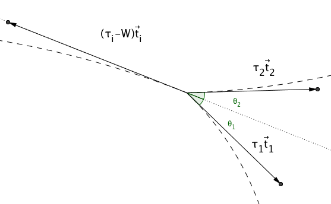

.. _lib_doub:

Cortical tension measured on liposome doublets
##################
.. 1

Introduction 
*************

We have seen that in cells the actin cytoskeleton is a key component to form
structures like the actin cortex that serve to transmit forces and gives
mechanical rigidity to cells. In order to drive shape changes, cells regulate the
mechanical properties of the sub-micrometer thick actin cortex that is found
beneath the membrane :cite:`Clark2013`. The dynamics of the actin cortex
drives cell shape changes :cite:`Salbreux2012b` and the presence of the
molecular motor myosin II plays a fundamental role for the tension of the
acto-myosin cortex :cite:`Tinevez2009`. Cortical tension can be measured on
cells to vary between 50 and 4000 pN/µm depending the activity of actin and
myosin.  These changes of the cortical tension are also affected by cell-cell
adhesions :cite:`Maitre2012` which have been shown to play a main role in cell
sorting. 

Recently, such acto-myosin cortices have been reconstructed on cell-sized
liposomes :cite:`Carvalho2013a` which showed that the attachment of the actin
cortex to the membrane plays a crucial role in the behavior and contractility
of the acto-myosin network. 

In the present study, I collaborated with Kévin Carvalho and Joël Lemière to
further extend the previously developed system :cite:`Carvalho2013a` with the
aim to monitor the cortical tension changes in a biomimetic actin cortex formed
on liposomes. My principal contribution was the analysis of the 3D data that
was acquired using Spinning Disk Microscopy. For the analysis I developed a
novel method to get an precise and unbiased measure of the geometrical
parameter.

To determine the role of cortical tension in cells, recent work used cell
doublets :cite:`Maitre2012`.  Here we form similar doublets from liposomes
around which we polymerize an actin cortex `in vitro` (:num:`Fig #fig1a`). The
shape changes of these liposome doublets allow the time dependent monitoring of
cortical tension in a non-invasive way.  In this project we hence develop a
method for the precise acquisition of doublet deformation in order to determine
accurately the increase of tension induced by the injection of myosin motor on
the preformed actin cortex.

Experimental description
************************
.. 2

.. image of peeling crunching ? 

Formation of liposomes doublets
===============================
.. 3

Liposomes are obtain by electro-formation (cf :ref:`Material and methods
<electroformation>`) from a mix of EPC and PEG-biotin lipids. The presence of
streptavidin in the working buffer allow liposomes to naturally stick together
to form doublets after 15 minutes (:num:`Fig #fig1a`).

.. _fig1a:
.. figure:: /figs/Fig_01-A.png
    :width: 50%

    Cell-sized liposome doublets. Doublets are indicated by white arrows in
    the field of view of a phase contrast microscope.

Formation of actin cortex on doublets
=====================================
.. 3
.. DOn't you describe this is in the mateiral and methods? You should refer to ti!

Formation of the actin network on doublets is done similar as described
recently :cite:`Carvalho2013a`.  Briefly, actin filaments including
biotinylated monomers are stabilized by phalloidin and linked to PEG-Biotin
lipids (cf :ref:`materials and methods <m_et_m>`)  via streptavidin that is
present in the solution (:num:`Fig #fig1b`).  Besides linking the actin to the
membrane, it also cross-links the filaments.  Such a network has already been
characterized recently :cite:`Carvalho2013a`.  Note that as the actin filaments
are only added after the formation of the doublets, the interface between the
two liposomes composing the doublets remains free of F-actin (:num:`Fig
#fig1c`, :num:`#fds`). As the actin added is fluorescent, the absence of actin
at the liposome interface can be checked by epifluorescence as it appears dark
compared to the rest of the doublet(:num:`Fig #fig1c`).

.. scheme equilibrium tension contact angle.

.. _fds:
.. figure:: /figs/doublets-schema.png
    :alt: Formation doublet schema
    :width: 70%

    Formation of doublets: 1) In the presence of streptavidin, single liposome
    (A) aggregate into doublets. (B) The addition of biotinylated actin
    filaments stabilized with phalloidin (2) forms liposome doublets covered
    with a micrometer-sized actin network (C). The interface between the two
    liposome is a double lipid bilayer free of actin filaments.

.. _fig1b:
.. figure:: /figs/Fig_01-B.png
    :width: 50%

    Schematic of the stabilized actin cortex at the membrane (proteins not to scale).

Visualisation of the interface
==============================
.. 3

.. _fig1c:
.. figure:: /figs/Fig_01-C.png
    :width: 50%

    i) Flow-chamber designed for buffer exchange. Doublets
    are visualized in the middle horizontal channel of the H shape chamber to
    avoid movement during the buffer exchange. Spinning disk images of the
    doublet before i) or after iii) myosin II injection. One liposome contains the fluorophore
    SRB (red) to visualize the interface of the doublet. The actin cortex is
    labeled in green. Scale bar 5µm.

.. (ARE YOU SURE? THIS STILL SEEMS TO BE A HUGE CONCENTRATION!)
.. Yes it is 0.9 µM, I checked with K

To visualise the interface between the liposomes, and to avoid the use of fluorescent
lipids that may affect the membrane mechanics :cite:`Sandre1999` the inside
buffer of approximately half the liposomes are labeled with 0.9 µM 
of sulphorhodamin B (SRB)
eventually leading to half of the doublets containing a single fluorescent liposome (:num:`Fig #fig1c` i and iii).

Geometrical parameters
======================
.. 3

To study the doublet geometry we model each liposome as well as the interface
between them as two spherical caps with their respective center and radius, as
sketched in :num:`figure #fig-notations-doublets`. 

.. _fig-notations-doublets:
.. figure:: /figs/notations-doublets.png
    :width: 50%

    Notation of parameters for the doublet model: |R1|, |R2|, |Ri| are respectively the
    radius of the liposome 1, the liposome 2 and the interface. |d| is the
    distance between the liposome centers. |theta1| and |theta2| are the angles between
    the tangents of the liposome surface and the tangent to the interface at the
    contact line. The total contact angle |theta| is the sum of |theta1| and |theta2|.

The center position in 3D (X,Y,Z) and the radius (R) of the three spherical caps
completely determine the doublet geometry, though it is interesting to look at other
parameters of the doublets which are :

    - the total volume of the liposome doublets `V`
    - the contact angle between the two liposomes
    - Each of the "half"-contact angles which are the angle between the
      interface and each of the liposomes :math:`\theta_1,\theta_2`
    - The distance between the liposome centers.

.. This model has a rotational symmetry along the axis connecting the
.. center of the three liposomes. We thus only consider one of the equatorial
.. planes when referring to the model. Unless otherwise specified, all components
.. outside of such a plane are null (HAE? I DON'T UNDERSTAND THIS PHRASE).

Experimental Observations
*************************
.. 2

Effect of myosin-II injection
==========================
.. 3

We image the liposomes doublets in an open chamber either in phase contrast
and epifluorescence, or spinning disk microscopy in the red (sulphorhodamin)
and green (actin) channel.

.. todo: brokenref

Muscle Myosin II that forms :ref:`bipolars filaments <myoII>` is carefully injected into
the chamber, and leads within minutes to a shape change (:num:`Fig #doublets-contraction`) 
of the doublets due to the contraction of the actin cortex. 

.. _doublets-contraction:
.. figure:: /figs/doublet-contract.png
    :width: 30%

    Doublets contraction showing green channel (actin): (A) doublet before
    myosin II injection. (B) doublet during contraction due to myosin II. Time=0 corresponds to myosin II injection.
    Scalebar is 5 µm 

.. |theta| replace:: :math:`\theta`
.. |theta1| replace:: :math:`\theta_1`
.. |theta2| replace:: :math:`\theta_2`

The distance between the liposome centers decreases as the total angle :math:`\theta
= \theta_1+\theta_2` increases. The contact angle and other parameters of the
doublets are obtained by fitting spherical caps onto the 2D epifluorescence
images or on the 3D confocal stack as :ref:`described later <full3dfit>`.  In the absence of myosin, the
contact angle |theta| is measured to be :math:`\theta = 64 \pm 16 ^{\circ}` (n=18) whereas in
the presence of myosin II (200 nM) we find a value of :math:`\theta = 86 \pm 21
^{\circ}` (n=5). Measurements of the contact angle after myosin II injection are done before the cortex
ruptures as characterized in :cite:`Carvalho2013a`.

Relation between the angles and tension
=======================================
.. 3

.. |tau1| replace:: :math:`\tau_1`
.. |tau2| replace:: :math:`\tau_2`
.. |taui| replace:: :math:`\tau_i`
.. |taut| replace:: :math:`\tau_t`
.. |W| replace:: :math:`W`
.. |V| replace:: :math:`V`
.. |d| replace:: :math:`d`
.. |R1| replace:: :math:`R_1`
.. |R2| replace:: :math:`R_2`
.. |Ri| replace:: :math:`R_i`

Each liposome has its respective tension |tau1|, and |tau2|.  In the absence
of the biomimetic acto-myosin cortex these tensions correspond only to the
tension of the liposome membrane. The interface between the two liposomes is
formed by two lipid bilayers, and the inter-facial tension is composed of two contributions:
The tension of the lipid bilayer, noted |taui|, and the
adhesion energy per surface unit |W| due to the biotin-streptavidin-biotin link
between the two lipid bilayers. The total tension at the interface can thus be
written :math:`\tau_t = \tau_i -W` :cite:`Maitre2012`.

As the movement of the contact line during the contraction is slow (order of
µm/min) compared to pressure equilibration across the doublet, we can consider
the contact line between the liposomes and the interface to be at equilibrium.
Hence, we can apply Young's equation: 

.. math::

    \sum_{k \in interfaces} \tau_k. \vec t_k  = \vec 0 \\
    \tau_i \vec t_i + \tau_1 \vec t_1 + \tau_2 \vec t_2 + = \vec 0
    
In which :math:`t_k` are the vectors tangent to the interface at the point of
contact, as described in :num:`figure #fig-yd`

.. _fig-yd:

    Equilibrium of the contact line. Each interfaces pull on the line with a
    force proportional to its tension. As the contact line is at equilibrium
    the some of the force compensate which allow to get a relation between the
    tensions and the contact angles.

    

This allows
to relate the tension of each of the lipid layers and the angle
between them at each instance of the contraction. We can in particular project
the result of this equation onto the direction of the contact surface
tangent (dotted line on :num:`figure #fig-yd`): 

.. Math::
    :label: young-tangent

    \tau_i - W = \tau_1.cos(\theta_1) + \tau_2.cos(\theta_2)

And on the direction perpendicular to it :

.. math::
    :label: young-perpendicular

     \tau_1.sin(\theta_1) = \tau_2.sin(\theta_2)

These equations link the tension to the contact angle both before, during and
after the contraction and hence remain correct during the experiment. In the following we will mark the values 
before the contraction phase by
the suffix `0`. Thus, for example :math:`\tau_{i,0}` refers to the
tension of the interface before the addition of myosin, and |taui| refers to the
tension of the interface at any instant of the contraction.

Contact angle dispersion
========================
.. 3
    

The value of the contact angle |theta| varies across different doublets both before
and after the  addition of myosin II. This reflects initial variations of tension in
:math:`\tau_{i,0}`, :math:`\tau_{1,0}`, and :math:`\tau_{2,0}` from doublet to doublet. Such variations could be
due to a difference in the liposome tension acquired during the different preparations, but also due to a
variation of adhesion energy between doublets, or alternatively an effect of tension build-up
during the formation of the actin shell. As the dispersion in contact angle is
in the same order as the increase in angle upon addition of myosin, a
statistical analysis of the contact angle before and during contraction is
problematic. Thus to avoid this effect of dispersion, we follow the evolution of
:math:`\theta` each individual doublet during time.

Tension of actin-shell
======================
.. 3

In order to investigate the increase of tension due to the acto-myosin network
on liposomes, we first characterise the increase that is only due to the addition of the actin-shell in
the absence of myosin. By destroying the F-actin via photo-bleaching (:num:`Fig #fig2a`) we compare the shape of the
same doublets in the presence and absence of the actin-shell. It should be noted that it is established that the 
actin filaments are destroyed by bleaching as this process frees oxygen radicals that denature the actin monomers. Hence, the bleaching process
actually destroys the actin cortex (:cite:`VanDerGucht2005`).
This investigation showed that the total contact
angle changes by :math:`3.4 \pm 2.0 ^{\circ}` (n=7) after disruption (:num:`Fig #fig2b`) of the actin network.
Thus we conclude that the change of tension due of the actin-shell is small and negligible
compared to the change in tension we see with myosin. 

.. _fig2a:
.. figure:: /figs/Fig_02-A.png
    :width: 50%

    Image of an individual doublet coated with fluorescent F-actin before i) ii) and
    after iii) iv) actin cortex disruption. The actin cortex is visualized by
    epifluorescence ii) iv) and the doublet by phase contrast i) iii). Scale
    bar 5µm.

.. _fig2b:
.. figure:: /figs/Fig_02-B.png
    :width: 50%

    Measurement of the contact angle between the two liposomes forming the
    doublet before (black) and after (white) disruption of the stabilized actin
    cortex as a function of their volume. 

.. _3d-obs:

3D observation
**************
.. 2

Three dimensional imaging of the doublets is necessary to get the correct
contact angle. This requirement comes from the fact that in simple 2D epifluorescence 
images, the focal plane would have to correspond to the equatorial plane of the doubles for correct analysis. If
this is not the case, the fit will produce a systematic underestimation of the contact angle. 
This is especially the case when doublets are of different radii as typically found in our
experiments, where the liposomes composing the doublets have an ratio of :math:`R_1 / R_2` between 1.15 and 1.82.

.. _confocal-stack:
.. figure:: /figs/light_table.png
    :width: 90%

    Confocal stack of an liposome doublet actin channel, 3D reconstruction in
    :num:`Figure #fig3a`. Note that there is no actin at the interface between
    the liposomes (Frames #11-#14). The distance between each image is :math:`\Delta z=0.85` µm.  

.. _fig3a:
.. figure:: /figs/Fig_03-A.png
    :width: 50%

    3D reconstruction of a doublet surrounded by actin. The absence of actin on
    the interface can be seen more easily on :num:`figure #confocal-stack`. 
    
.. (It would be good to have here an image tht gives an impression of the 3D structure. The reconstruction given looks like a simple 2D image. I think imaris can produce nicer examples.)
    

Time resolved 3D Spinning disk stacks (:num:`Fig #confocal-stack` with 3D reconstruction
:num:`Fig #fig3a`) are recorded with a time resolution of less than 5 seconds per stack for an accurate determination of the different
parameters of the doublet over time. The analysis reveals the contact angle |theta| (:num:`Fig #fig3b`) , the
volume of the doublet |V| (:num:`Fig #fig3d`) and the distance between liposome
centers :math:`d` (:num:`Fig #fig3c`). All theses parameters are obtain by
fitting spherical 3D caps on the 3D stack as explained :ref:`later<full3dfit>`. 

.. _fig3b:
.. figure:: /figs/Fig_03-B.png
    :width: 50%

    Evolution of the contact angle compared to its initial value as a function of
    time.  Each doublet is represented by a different colors. The color code corresponds to the doublet
    shown in figure :num:`#fig3c`, :num:`#fig3d`
    and :num:`#fig3e`. A special case is shown in the blue dashed line, 
    where the actin cortex on the doublet ruptured, and the cortex is peeled off. 
    The analysis of this case showed that the contact angle after rupture recovers its initial value.

.. _fig3c:
.. figure:: /figs/Fig_03-C.png
    :width: 50%

    Evolution of the distance between liposome centers as a function of time.
    Same color code for same doublets as in figure :num:`#fig3b`, :num:`#fig3d`
    and :num:`#fig3e`. Again the doublet with the ruptured cortex recovers its initial parameter values.

.. _fig3d:
.. figure:: /figs/Fig_03-D.png
    :width: 50%

    Evolution of the volume ratio over time.
    Same color code for same doublets as in figure :num:`#fig3b`, :num:`#fig3c`
    and :num:`#fig3e`. 

During contraction triggered by myosin, we observe that the contact angle
|theta| increases while the distance between liposome centers |d| decreases.
During this process the volume remains constant within the error of 10%.  These
results are consistent with the measure of contact angle in freely adhering cell
doublet experiments done previously :cite:`Maitre2012`. 

.. The interface between the two liposomes is a part of a sphere with a curvature
.. :math:`C_i= \frac{1}{R_i}` much smaller than :math:`\frac{1}{R_1}` and
.. :math:`\frac{1}{R_2}`. The test to determine the radius :math:`R_i` proved to be 
.. difficult as the interface both before and
.. after myosin injection differed by only a few pixels from a flat surface in most
.. of the cases. Combining the small deviation of the interface from a flat surface with the small size assymtries
.. leads to our finding that |theta1| and |theta2| remained equal within
.. our optical resolution.
.. (I move the two previous paragraphes to the end, since I did not understand what they did at that position. Still, I am not sure why you say that. It wold be great to bring these two statements into a bigger context.)

Discussion 
***********
.. 2

Cortical tension is homogeneous for single doublet
==================================================
.. 3

Combining equation :eq:`young-perpendicular` with the finding that :math:`\theta_1 = \theta_2 = \theta
/2` allows to infer the equality of tension on both side of the doublet during all the
experiments. We can hence write :math:`\tau_1 = \tau_2 = \tau`. This result is
consistent with the fact that actin is distributed continuously all around the
liposome doublet. Hence, myosin II minifilaments pull on a continuous shell. In
these conditions equation :eq:`young-tangent` simplifies to :

.. math:: 
    :label: eq3

    \tau_i - W = 2.\tau(t).cos(\theta(t)/2)

Where :math:`\tau(t)` and :math:`\theta(t)` are the tension and the angle at
the time t after myosin injection. Assuming that
:math:`\tau_i-W` may depend on a variability of the initial adhesion between
liposomes. Since myosin does not operate at the interface between liposome as
this is free from actin, it is reasonable to consider the tension and
adhesion energy constant for a given doublets over time
:math:`\tau_i-W = \tau_{i,0}-W_0`.
Therefore we obtain an expression of the tension :math:`\tau(t)` during the acto myosin contraction that reads : 

.. math::
    :label: eqtime

    \tau(t) &= \frac{ \tau_i - W }{2.cos(\theta/2)}\\
            &= \frac{ cst           }{2.cos(\theta/2)}

Hence we can evaluate the tension relative to its initial value over time :

.. math::

    \frac{ \tau(t) }{\tau_0} = \frac{cos(\theta_0/2)}{cos(\theta(t)/2)}

Relative increase in cortical tension
=====================================
.. 3

Interaction of myosin II filaments with a biomimetic actin cortex induces
tension build up. The cortical tension, normalized to its initial value,
increases and reaches a plateau where :math:`\tau(t) = \tau_{peeling}` 
(:num:`Fig#fig3e`) with the same trend as |theta|.  Note that if the acto-myosin shell
breaks and peels, the doublet recovers its initial shape (see dashed blue line
for :math:`d` and |theta| on  :num:`Fig #fig3b`, :num:`#fig3c`, :num:`#fig3d` ). The average relative tension is found to
be :math:`\tau_{peeling}/\tau_0 = 1.56 \pm 0.56` (n=5) in 3D and
:math:`\tau_{peeling}/\tau_0  = 1.25 \pm 0.15` (n=5) in epifluorescence, in
agreement with discussed expected underestimation of the contact angle in epifluorescence measurements. 

.. _fig3e:
.. figure:: /figs/Fig_03-E.png
    :width: 50%

    Increase of the tension ratio between the tension :math:`\tau(t)` at time
    :math:`t` and the initial one :math:`\tau_0`. 
    Same color code for same doublets as in figure :num:`#fig3b`, :num:`#fig3c`
    and :num:`#fig3d`. The actin cortex rupture in the blue dashed line also presents the highest relative tension increase. 

Cortical tension increase in doublets and in cells
==================================================
.. 3

In cells, cortical tension can be as low as 50 pN/µm in fibroblast progenitor
cells :cite:`Krieg2008` and can go up to 4000 pN/µm for
dictyostelium :cite:`Schwarz2000`. Surprisingly, when myosin activity is
affected, either by drugs or by genetic manipulation, the cortical tension only
decreases by a factor of about 2. Cells are also observed to round up during
division  in which an  increase of tension by a factor of two
is sufficient :cite:`Stewart2011`, :cite:`Kunda2008` .  
Our `in vitro` reconstruction is able to reproduce similar 
changes of cortical tension as we observe a cortical tension increase by a factor of up to 2.4.

Different contributions for cortical tension
============================================
.. 3

.. todo: 2 missing citations

Cortical tension is the sum of the membrane tension and the tension due to the
acto myosin cortex. We question how the membrane contributes to cortical tension
and in our assay we show that it may account for approximately 50% of the cortical tension in some cases.
In suspended fibroblast cells, membrane tension is estimated to be 10% of the
cortical tension :cite:`Tinevez2009`. When polymerisation of actin is
stimulated, the cortical tension is multiplied by a factor of 5 showing a
strong dependence also with actin dynamics :cite:`Tinevez2009`. Hence he
residual tension in cells might be due to actin dynamics which is absent in our
experiments. How actin contribute to cortical tension is still an open question
that needs to be addressed in the cell geometry.  Whereas actin polymerisation
outside a liposome has been shown to generate inward pressure,
how this can be translated to tension  in a different geometry is
not yet clear. `In vitro` assays are on their way to mimic actin dynamics in
cells :cite:`AbuShah2014` and will allow to unveil the mechanisms of tension build up by
actin dynamics, which is the remaining module that needs to be understood. The
effect of myosin and of the membrane being clarified in this study.

Conclusion 
===========
.. 3

We provide a biomimetic reconstitution of the tension build up by acto-myosin 
contractility using liposome doublets. Cortical tension changes are visualized 
`in situ` over time by analyzing doublet shape changes. This method allows us 
to directly quantify the relative increase in tension due to myosin, separately 
from the one due to actin dynamics. Understanding the contraction of composite systems 
that are rebuilt brick by brick to finally model a living cell will hopefully lead the way towards for a reconstitution 
of complex systems like tissues.

.. _full3dfit:

3D fitting
**********
.. 2

Obtaining the geometrical parameter of doublets remains challenging as in
classical phase contrast and epifluorescence microscopy the acquired images
only capture a single focal plane of the doublets. This makes the analysis 
difficult as the observation plane should be the 
equatorial plane of the doublet.

In order to achieve good precision in the measurements of the contact angle we
decided to use confocal microscopy and acquire evenly spaced z-stacks. From
theses stacks the 3D structure of a doublet was reconstituted. Using the 3D
structure of the doublets allows to recover the geometrical parameters and
the contact angle.

To determine the geometrical parameters of the doublets 
we modeled the doublets as two intersecting spheres, determined the expected 3D
images and adjusted the parameters of the model to resemble the obtained
experimental data. 

I was responsible for developing a fast and precise method to reliably and
automatically recover the geometrical parameters of the liposome doublets
based in the image stacks acquired using spinning disk microscopy. In the following part I will develop the principle of this
method and the result on liposomes doublets.

First step: Fitting a single liposome
=====================================
.. 3

In this part we show the principle that allow us to determine the 8
geometrical parameter that characterise a doublet: 2 centers (X,Y,Z) and 2 radii
(|R1| and |R2|). 

As the principle for finding the geometrical parameter does not differ with the
number of dimensions, the presented methods can be applied even in higher dimensions (e.g. deformed
ellipsoid liposome, or multi channel imaging). Furthermore, the principles remain the same also in a
space with less dimensions, so we will restrict our discussion to a single liposome
in a 2D plane (X,Y position of centers and R, radius) hence reducing the parameters to be determined to six instead of eight.

Experimentally, liposomes are observed using fluorescently labeled actin that
forms an homogeneous micrometer sized actin shell. In the observation plane,
the liposome is a bright ring of given thickness (we will refer to this as the
`expected signal`) , on top of this image is the experimental noise where the
principal noise sources are identified to be the presence of fluorescent actin monomers in the
buffer solution and electronic noise from the CCD camera. Eventually, the noise
in the outside buffer due to monomeric actin can be higher than inside which is
free of actin. 

The signal from a liposome and the addition of noise can be replicated
numerically as seen on  :num:`figure #fig-2d-sim`.

.. _fig-2d-sim:
.. figure:: /figs/modl-2D-doublet.png
    :alt: liposome Model

    Left : A simulation of liposome fluorescent image consisting of an uniform shell or membrane
    (`expected signal`).  Middle: Same Image Adding Gaussian noise. This simulates
    one plane of a confocal Z-stack.  Right: Simulation of liposome with
    fluorescently labeled actin shell in a fluorescent external buffer and non
    fluorescent inside buffer.

The `expected signal` can be modeled numerically using several parameters of
the system (center and radius of liposome, point spread function of microscope,
...). 

To find the correct parameters for the doublets we will numerically correlate 
the acquired data with the numerical model and search for the correlation 
that correspond best to the real image. The correlation between the model and the images 
data can be written.

.. math::

    r_{xy}=\frac{\sum\limits_{i=1}^n (x_i-\bar{x})(y_i-\bar{y})}{(n-1) s_x s_y}

In which :math:`x_i` are luminosity values of each of the :math:`n` pixels in
the acquired data, :math:`y_i` are the luminosity of the pixels in the model
:math:`\bar{x},\bar{y}` correspond to average values over the images,
:math:`s_x` and :math:`s_y` are the standard deviation of the luminosity
values.

As the monomeric fluorescently labeled actin and the electronic noise are dominant
in the acquired images, we can assume a uniform noise on top of the `expected signal`. The correlation between the model and the noise is in average
uniform.

.. math::
    r_{noise,model(params)} = cst

And the correlation between the `expected signal` and the model is expected to be
maximal for the parameters of the model that  equal the real geometrical
parameters of the doublets.

.. math::

    \operatorname*{arg\,max}_p\left(r_{data,model(p)}\right)= \operatorname*{arg\,max}_p \left(r_{expectedSignal,model(p)}\right)

In which :math:`\left(\operatorname*{arg\,max}_p\right)` stands for the
argument of the maximum, that is to say, the set of points of the given
argument for which the given function reaches its maximum value. Thus searching
for parameter values that maximize the correlation between the model and
the data implies finding the geometrical parameters we are interested in.  

We can test the ability to do this numerically by generating data, adding noise
to it and trying to recover the parameters of the `expected signal`.

By looking at the value of the correlation between the generated data and the model
as a function of model parameters, we can check that the correlation
values are maximal when the model center value correspond to the `expected signal` 
center value (Figure :num:`corr-fun-1`), and when the radius of the model liposome 
has the same radius in the model correspond to the radius in the generated data (Figure :num:`corr-fun-2`).

.. .. figure:: /figs/corrfun-noise-.png

.. _corr-fun-1:
.. figure:: /figs/double-c-_100-by-100-rc-40_0-noise-0_5-delta-4_0_.png 
    :alt: liposome Model
    :width: 50% 

    Value of the correlation as a function (arbitrary units) of two of the fit
    parameters. The radius of the liposome in the model is taken as
    equal to the value of the `expected signal`, and the position of the center is
    varied in the X and Y direction. The value of the correlation is maximal for
    the position of the center in the model that equals the center of the `expected signal`.  We
    can see local maxima on the 3D representation that are well below the value
    of the global maximum. The peak at the global maxima is sharp, hinting that 
    the search of the maxima need relatively good initial
    parameters (lower than ~1/10 of liposome radius). The sharpness of the peak
    point that corresponds to the best fit parameters on experimental data should be
    robust.  
    
.. _corr-fun-2: 
.. figure:: /figs/c-R-_100-by-100-RC-40_0-noise-0_5-delta-4_0_.png 
    :width: 60% 

    Same as :num:`figure #corr-fun-1`  with Y position of the center taken
    as equal to the expected signal, variating X position of the model and
    radius of the liposome. The graph shows the same properties as before.

Using minimisation techniques we can search the parameter space of the model and
maximise the correlation between the model and the experimental data. We then
recover the geometrical parameters of the liposomes. This can be done by
efficiently computing the value of the correlation within a few hundreds of
points and which gives access to the liposomes' geometrical parameters, here position
and radius.

Fitting a doublet
=================
.. 3

The determination of the contact angle on epifluorescence images or phase contrast
images often results in an underestimation as the imaging plane is not necessarily one of the doublets
equatorial planes. Moreover, most determination of the contact angle on phase
contrast and epifluorescence images are done manually :cite:`Maitre2012` and
are subject to experimenter bias as the experimenter draws the tangent lines at the
contact point between the liposomes. Thus we decided to develop fitting routines for the acquired
3D confocal stacks. In our case we avoid the usage of
fluorescent lipids that could artificially change the tension of the membrane.

As sketched in :num:`Figure #fds`, the doublets are covered with a
thin micrometer-thick layer of fluorescent actin filaments, which we 
image by confocal spinning disk microscopy. As the actin-layer is attached to the membrane
and the contact angle is defined as the angle between the lipid bilayer, imaging the actin-layer corresponds
to the angle between the inner surfaces of the two actin networks present on each liposome.

Thus in order to determine the geometrical parameters of the doublets we need
to also model the actin shell. As the liposomes in contact are two spherical
caps the uniform actin layer will also form two spherical caps with a given
thickness. The total image is thus the union of two spherical caps blurred by
the point spread function of the microscope. This can be seen on :num:`figure
#mproj1`.  We can see on this image that the doublet is here lying on the
chamber surface. We checked in this case that the contact surface between the
chamber and the doublet did not change during experiments.

.. (The figures shows tha the doublet is attached to the surface. You might want to discuss this?)

.. _mproj1:
.. figure:: /figs/max_proj_340A.png
    :width: 80%

    Maximum projection along X,Y and Z of recorded stacks, green channel represents actin.
    One can see that the liposome doublets are lying on the surface of the
    observation chamber (arrows). 
    
    

As the contraction of the doublets is rapid, and the recorded 3D stacks contain a
large number of frames. Hence it is crucial to be able to compute the model and the
correlation in a reasonable time (less than an hour per images). To
achieve this besides calculating the model as efficiently as possible one can
replace the exact calculation of two spherical cap and the point spread
function of the microscope by the union and subtraction of pre calculated spheres followed by a 3D
numerical Gaussian blur.

.. figure:: /figs/3dblur.png
    :width: 60% 

    Principe of numerically approximating the two spherical caps as intersection of two spheres, 
    followed by a 3D numerical Gaussian blur. The
    numerical speed-up compared to the exact calculation of the fluorescent density allows
    to make fits on doublets in minutes instead of hours.

However, the use of such numerical techniques is not without artifacts.  In the case of
discreet Z-stack that are not sufficiently spaced, the different radii in the
fluorescent rings within subsequent stacks can lead to a "ring-artifact" (:num:`Fig
#ring-artifact`) when using numerical Gaussian blur. In the case of a too
pronounced "ring-artifact" a "ghost" spheres can appear around each liposome
which can cause the fitting process of the doublets to fall into a local
maximum of correlation, thus leading to wrong value of the geometrical
parameters.

.. _ring-artifact:
.. figure:: /figs/ring_artifact.png
    :width: 70%

    Left : One plane of the numerical model with an exaggerated ring artifact due
    to an under sampling of the model in the Z-direction, stacks from "Far" Z
    leak onto the current Z-plane and form a ring.  Right : Same plane of the
    model with enough sampling plane in the Z-direction do not show the ring
    artifact. In this case we use a sampling equal to the number of slice than
    the recorded data. (X,Y in arbitrary units)
   

In our case we have a sufficient number of planes per stack so that the numerical model
with the same sample size as the data do not show the ring artefact and have
smooth transition near the position of the spherical cap. Though the ring
artifact can be eliminated by oversampling/interpolating the model before the
numerical Gaussian blur and under sampling afterwards to arrive at the correct number of
pixels.

The size of the
Gaussian blur can also be adjusted to be higher which will act as a regularisation
function for the value of the correlation between the model and the acquired
data (cf :num:`Figure #max-proj-model`), thus smoothing or eliminating local maxima, 
but reducing the precision in the position of the maxima.

.. _max-proj-model:
.. figure:: /figs/max_proj_model.png
    :width: 50%

    Maximum projection along X,Y and Z of numerical model, the "ring" effect
    can still slightly be seen near the pole of each liposome, but is not
    sufficient for the fit to be stuck in a local minimum. 

The value of the correlation between the model and the experimentally recorded
data can be maximised using already available functions, in particular we used
the Nelder–Mead simplex algorithm as implemented in `scipy.optimise` python library. This
gives us the 8 parameters of the doublets. Result of the fits are show in
:num:`figure #fig-fit-t0`.

.. _fig-fit-t0:
.. figure:: /figs/Doublet-402-A-Fit-t-0.png
    :width: 50%

    Maximum projection of confocal images in the X,Y and Z projection as well
    as the result of the fits shown as equatorial circles for the three
    direction of projection.

Using the fast Cython code (:cite:`Seljebotn2009`) also allowed to also speed
up fitting to a reasonable time: one Z-stack of 3 millions pixels can be fitted
in about 40 seconds. Thus allowing the fitting of a full 3D movie of a doublets
contraction to be done in less than an hour for 30 to 40 frames.

To ensure robustness of the fits to doublet center displacement during
acquisition, the initial parameter of the fit where chosen manually for each
first frame of each sequences. The final fit parameters of each frame are reused
as initial fit parameter for the subsequent frame.

In order to test robustness of the fit, the initial fit parameters where randomly
modified by an amount of +/- 1µm, and we checked that the final parameters did
not vary.

For a couple of parameters, the values of the correlation function can be plotted
to check for the regularity of the function and the absence of local maxima. :num:`Figure #gof2d` and :num:`figure #gof3d` show the resulting correlation values.

.. _gof2d:
.. figure:: /figs/gof-2d-doublets.png
    :width: 60%
    
    Correlation of the model and the data as a function of the center position
    of one of the model spherical caps along the X axis and the radius of this
    same spherical cap. Vertical axis in arbitrary unit.

.. _gof3d:
.. figure:: /figs/gof-3d-doublets.png
    :width: 60%

    3D representation of the data in :num:`figure #gof2d`, the shape of the
    function is the same as the simulation done with the `expected signal` in
    :num:`figure #corr-fun-1` :num:`and #corr-fun-2`

The correctness of the fit is also checked visually to prevent errors in the
procedure.  The fit was found to be alway accurate and coherent with manual
measurements of the contact angle.  When the red channel was also present and liposomes
contained sulphorhodamin B, fits where additionally visually checked by using maximum
projection of the red channel.  (Cf :num:`Fig #srhod`).

.. _srhod:
.. figure:: /figs/srhod_superimpose.png
    :width: 80%

    Maximum projection of the red channel (`sulphorhodamin`) and the fitted
    parameter for the doublet.
    

Discussion
==========
.. 3

In this part we show that by modeling the liposome doublet and using
fluorescently labeled actin we are able to develop a technique that
automatically and robustly determine the geometrical properties of the liposome
doublets.

We note that the red fluorescent dye present in the inside buffer of the
liposome could be used conjointly to the green channel in order to improve the
quality of the fit, though this would require the extra parameters of the
interface radius. As the computation time needed to fit the doublets increase
rapidly with the number of parameter, this solution was found to be
impractical.  Moreover, the curvature of the interface being relatively small
and the difference between the curved interface and a flat plane being close to
the optical resolution, hence the fits risk to become unstable.  The use of
fluorescently labeled lipids for the liposome membrane also suffers from the
same issues of extra parameter if one want to recover the position of the
interface.

Conclusion
==========
.. 3

We developed a robust and automated method to determine the geometrical
parameters of liposome doublets. This allows to determine robustly the 
geometrical parameters of liposome doublets without
experimenter measurement bias due to the selection of the illumination plane,
resolution of optics and luminosity scale.

We have seen that liposome doublets with reconstituted acto-myosin cortices are
a biomimetic system that allows to measure the changes in cortical tension with 
time. 3D fitting helped to quantify the tension by obtaining the corresponding contact angles. 

Observing the contraction of multiple liposomes doublets simultaneously and the
ability to automatically determine the geometrical parameters allows more
sample to be collected. Faster and more reliable data acquisition on actin
network contractions will allow for a better understanding of the effect of actin
network `in vitro` which also pave the way to reconstitution of more complex system.
