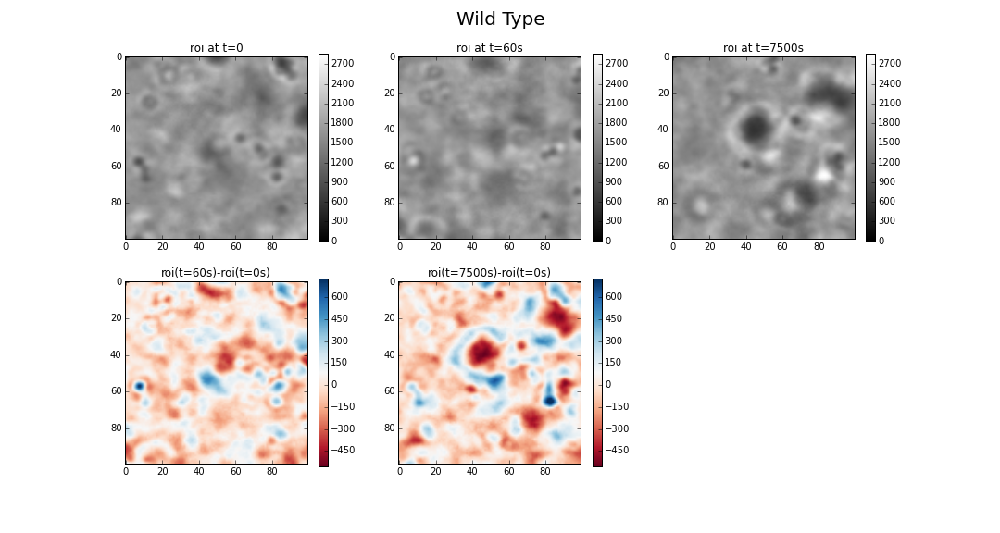
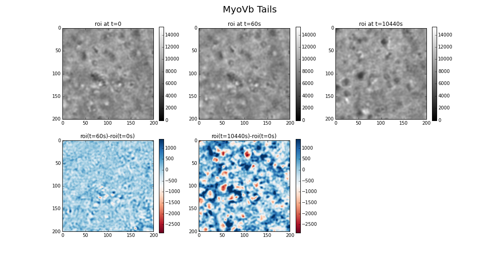
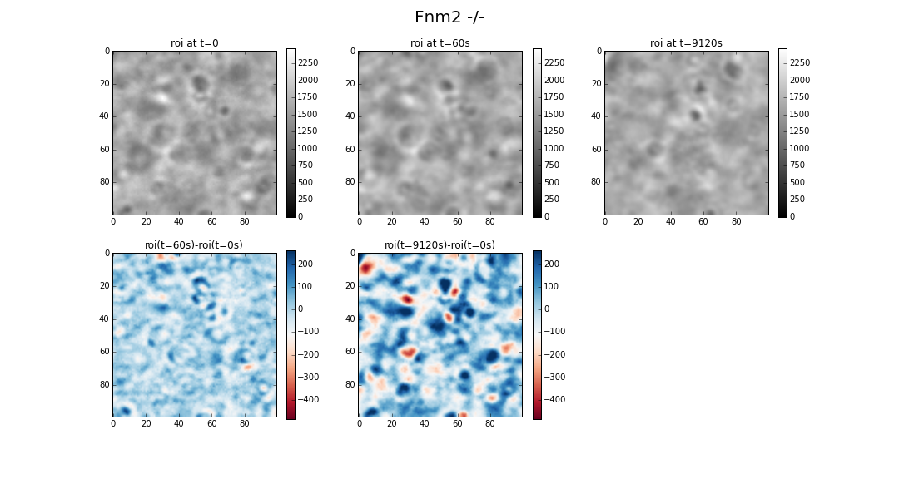

Activity in oocyte cytoplasm
############################
.. 1

Introduction
************
.. 2

Mouse oocyte are big spherical cell with a diameter in the order of 80 µm.  It
ha been shown that the spindle positioning during meiotic division of oocyte is
dependant of an actin meshwork present in the cell :cite:`Schuh2008`.  This
actin meshwork is regulated by endogenous vesicle which dynamic is myosin-Vb
dependant :cite:`Holubcova2013`. In a collaboration with Marie-Hélène Verhlac
and Maria Almonacid in Collège de France, we designed a way to  measure
cytoplasmic activity in mouse oocyte.

:num:`Figure #oocytewt` shows a mouse
oocyte where the nucleus can be seen positioned at the center of the cell.

.. todo:

    Maybe mention that actin is important in this positioning.

.. _oocytewt:

.. figure:: figs/oocyte-wild-type.png     
    :alt: "Bright field image of an oocyte"
    :width: 60%

    Bright field image of a mouse oocyte before meiosis. Cell diameter is of
    80µm. The nucleus can be clearly seen at the center of the cell. The
    nucleus is positioned at the center of the oocyte during Meiosis I by the
    help of the actin network. The positioning is a crucial factor for the
    normal division of the oocyte.  Oocytes are a good reference system  by
    their symmetry and their sufficient size that help measuring spatial
    variation of mechanical properties.  Image Credit to Maria Almonacid from
    Collège de France.

OOcytes
*******
.. 2

As oocyte meshwork in oocyte is controlled by the activity of formins than
drive actin polymerisation and Myosins Vb that controlled the dynamism of the
vesicle in the meshwork, we decided to develop the analysis in 3 type oocytes.
Wild types oocyte, oocyte preleved on Formin 2 invalidated female that lack the
actin meshwork and oocytes injected  with the dominant-negative tail of Myosin
Vb (:num:`Fig #fig3oo`)

.. _fig3oo:
.. figure:: figs/3-oocytes.png
    :width: 100%

    Bright field image microscopy of the 3 kinds of oocyte (Credit to Maria
    Almonacid, Collège de France). WT) Image of Wild Type OOcyte, Scalebar is
    20µm. Fmn2-/-) Oocytes extracted from females with invalidated Formin 2,
    theses oocytes lack the actin meshwork. MyosinVb Tails) Oocyte injected
    with a Myosin Vb dominant negative tail have a less actin vesicle
    population.

Measure of activity
*******************
.. 2

The diffusion of actin positive vesicle ta can be seen during oocyte meiosis is
less important in Formin -/- and MyosinVb-tails oocytes than in Wild type.
While particle tracking with the vesicle present in oocyte is possible, it is a
complex process especially with the diffusion of vesicle outside the focal
plane of the microscope. In order to measure the activity we thus decided to
investigate the variations of the bright field images in mouse oocyte.

We can compute the difference between  region of interest (ROI) of images as a
function of time to see how fast the bright field image changes. We can compare
the result for wild type (:num:`Fig #decay-wt`), Formin Knockout (:num:`Fig
#decay-fmn2`) and MyosinVb dominant negative tail (:num:`Fig #decay-myo`).

.. _decay-wt:

    Bright field images of Wild type mouse oocyte at t=0, t=1m et t=174m as
    well at the difference between t=1m, t=174m and initial image. Blue
    indicate that the later image is brighter that the original one and red
    indicate that it is darker.  For wild type oocyte, we can see that the
    scale difference between images is similar for a :math:`\Delta t` of 1
    minute and 174 minute. Region show is the same as indicated in :num:`figure #fig3oo`.

.. _decay-myo:

    Bright field images of MyoVb tails mouse oocyte at t=0, t=1m et t=174m as
    well at the difference between t=1m, t=174m and initial image. Blue
    indicate that the later image is brighter that the original one and red
    indicate that it is darker.  We can see that the difference between images
    is much stronger after several hours (174min) than after a minute, unlike
    in :num:`Figure #decay-wt`. Region show is the same as indicated in :num:`figure #fig3oo`.

.. _decay_fmn2:

    Bright field images of Fmn2-/- mouse oocyte at t=0, t=1m et t=174m as well
    at the difference between t=1m, t=174m and initial image. Blue indicate
    that the later image is brighter that the original one and red indicate
    that it is darker.  We can see that the difference between images is much
    stronger after several hours (174min) than after a minute, unlike
    in :num:`Figure #decay-wt`. Region show is the same as indicated in :num:`figure #fig3oo`.

A quantitative measurement of the difference of the images is the
autocorrelation of these thought time. The correlation of two images :math:`x`
and :math:`y` of same dimension is defined as :

.. math::

    r_{xy}=\frac{\sum\limits_{i=1}^n (x_i-\bar{x})(y_i-\bar{y})}{(n-1) s_x s_y}

    
In which :math:`x_i` and :math:`y_i` are luminosity values of each of the
:math:`n` pixels in :math:`\bar{x},\bar{y}` correspond to average values over
the images, :math:`s_x` and :math:`s_y` are the standard deviation of the
luminosity values.

We can compare the decrease of correlation with time depending on the type of
oocyte. In order to extract a single value that represent the activity, we can phenomenologically fit the correlation as a function of time with a decaying exponential with an offset :

.. math:: 
    :label: edecay

    r(t) = (1-off).e^{(-t/\tau)}+off

In which :math:`t` is time, and :math:`\tau` is the characteristic time of
correlation decay. The offset  :math:`off` represent the value of the
correlation at infinite time to take into account artifact in the chosen region
of interest, and defect in the image that will not decorrelate through time. 

Example of the result of calculating the correlation through time, and fitting
a decaying exponential can be seen on :num:`figure  #fig-exp-decay`

.. _fig-exp-decay:
.. figure:: figs/corrtime.png
    :width: 65%

    Decreasing of autocorrelation off images  (solid line ) through time, with
    exponential decay fit (dotted lines) as in :eq:`edecay`, and value of the
    characteristic decay time :math:`\tau` as legend. We can see that the
    correlation of the images decrease much faster in wild type oocyte (red
    curves, :math:`\tau \sim minute`) than in Formin knockout (blue lines
    :math:`\tau \gt hour`) that lack the actin meshwork, or than the myosin Vb
    tails dominant negative (green :math:`\tau > hour`)

We see the value of the characteristic time increases with when we disrupt the
actin network or the  source of its dynamism by inactivating Myosin Vb. We can
then use the inverse of :math:`\tau` as an indicator of activity.

Once we have define the activity of a region of the cytoplasm of the cell, we
can repeat the measurement on different area of the cytoplasm, and we can
reproduce a map of the activity in the cell as a function of the position (
:num:`Fig #fig-activity-map`.

.. _fig-activity-map:
.. figure:: figs/CellAct-WT.png
    :width: 80%

    Activity for different region of  10 by 10 pixels of a wild type oocyte.
    Value of :math:`1/\tau` plotted as color square overlay on to of the
    analysed bright field image. Example for an of a wild type oocyte. Scale
    bar is 20 µm. We can see that the activity is near the nucleus is lower
    (blue) than in the middle of the cytoplasm. 

The measure of the correlation characteristic decay time can also be done on a
time sliding widows. This allows for the determination of activity of a
particular area of the cytoplasm with time.

Conclusion
**********
.. 2

In this part we developed a methods that allow to determine the cytoplasmic
activity. Tis methods also allow to determine the variation of this cytoplasmic
activity with space and time. This methods is the study of oocyte as it allows
to probe timescale from the second to the hour which is in the order of the
relevant timescale for oocyte maturation of a few hours. It is also
complementary to techniques like micro rheology that have difficulties probing
timescale beyond tens of seconds due to thermal drift and cell movements, but
reach much shorter timescale.

The use of this technique is currently under investigation at Collège de France
by Marie-Hélène Verhlac and Maria Almonacid. It is used to measure the activity
of actin network in oocyte and determine their effect on the meiosis of mouse
oocyte.

