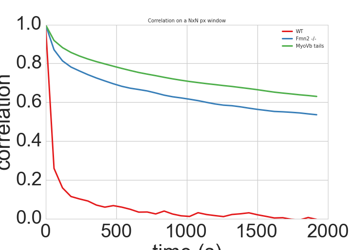

Active cytoplasm movement in mouse oocytes
##########################################
.. 1

Introduction
************
.. 2

Mouse oocytes are big spherical cells with a diameter around 80 µm.  A previous work has established
that the spindle positioning during meiotic cell division in oocytes depends 
on an actin meshwork present in the cell's cytoplasm :cite:`Schuh2008`.  This
actin meshwork is regulated by formin, localized to endogenous vesicles. 
Additionally, these vesicles recruit the myosin-Vb motor proteins, that are known to drive the vesicles active movement
in the cytoplasm :cite:`Holubcova2013`. In a collaborative project with the group of Marie-Hélène Verlhac
and her Postdoc Maria Almonacid at the Collège de France, I designed a way to measure the cytoplasmic activity in mouse oocytes.

:num:`figure #oocytewt` presents a typical mouse
oocyte, where the nucleus can be seen positioned at the center of the cell.
In this system, current questions relate to the mechanical processes during meiosis such as the chromosome migration, 
the asymmetric cell division and the organelles positioning by the dynamic remodelling of the actin network. 
While our team did active and passive microrheology measurements on timescales of 10 seconds, I developed a 
suitable method  for longer timescales in the order of minutes, more relevant for the meiosis process. 

.. _oocytewt:

.. figure:: figs/oocyte-wild-type.png     
    :alt: "Bright field image of an oocyte"
    :width: 60%

    Bright field image of a mouse oocyte before meiosis (scale bar is 20 µm).
    The cell diameter is about 80µm. The nucleus is positioned at the center of
    the oocyte during meiosis with the help of the actin network. The
    positioning is a crucial factor for the normal oocyte division. The
    oocytes are a good reference system as they provide a clean spherical
    symmetry and due to their size, give a good spatial difference between the
    cortex and the cytosol, which helps to measure the spatial variations of
    mechanical properties and vesicle movement. Image Credit to Maria
    Almonacid, Collège de France.

Oocytes
*******
.. 2

The cytosolic actin meshwork in oocytes is controlled by the activity of formins (Fmn2) that
nucleate actin polymerisation, and by the activity of the vesicle-bound molecular motor protein myosin Vb that 
controls the dynamic movement of the
vesicles in the actin meshwork. Hence, it is of interest to study oocytes with formin and myosin Vb deficits. 
We focused more particularly on three types: 1) Wild type oocytes, 2) oocytes prepared from Formin 2 invalidated female
(Fnm2-/-) that lacks the
actin meshwork and 3) oocytes injected with the RNA coding for the dominant-negative tail of Myosin
Vb (:num:`Fig #fig3oo`), thus replacing the active myosin Vb on the vesicles. 

.. _fig3oo:
.. figure:: figs/3-oocytes.png
    :width: 100%

    Bright field image microscopy of the 3 kinds of oocytes (Credit to Maria
    Almonacid, Collège de France). WT) Image of Wild Type Oocyte, Scale bar is
    20µm. Fmn2-/-) Oocytes extracted from females with invalidated Formin 2,
    lacking the actin meshwork. MyosinVb Tails) Oocyte injected
    with the RNA coding for Myosin Vb dominant negative tails. These cells have a less active vesicle
    population. The white square gives an example of the region used for the analysis presented in this chapter. 

Measure of activity
*******************
.. 2

The diffusive-like motion of actin-positive vesicles that can be observed during oocyte meiosis is
reduced in Fmn2-/- and MyosinVb-tails oocytes when compared to the wild type.
While the use of particle tracking algorithms to measure vesicle motion in oocyte is possible, it remains a
complex process especially as the vesicles may move outside the microscope focal
plane. As a simple approach to measure the vesicle activity, we decided to
investigate the bright field images temporal variations in mouse oocytes.
We could compute the time-dependent difference between predefined regions of interest (ROI) in an image
series, to determine how fast the bright field images change. We finally compared
the results between wild type, Formin Knockout and MyosinVb dominant negative tails (:num:`Fig #decay-all`).

.. _decay-all:
.. figure:: figs/decay-all.png
    :width: 80%

    Bright field images of the 3 mouse oocyte types : Wild type in the first column,
    Formin knockout in the second, Myosin Tail dominant negative in the third. Rows 1
    to 3 represent the region of interest of :num:`figure #fig3oo` (20 µm side)
    for each kind of oocyte. Row 1 shows regions of interest at t=0s, row 2 at
    t=1min and row 3 at t=10min. The color-coded difference between images at
    t=0s and 60s are shown on row 4, and between t=0s and 10min on row 6. Blue
    indicates that the later image is brighter that the original one and red
    indicates that it is darker. For wild type oocytes, the images
difference
   rapidly reaches its maximum value (Image J and M similar), whereas for
    Fmn2-/- and MyoVb, the difference between images at 60 second intervals?
    (K,L) is much smaller than after 10 minutes (N,O), and defined as follows :
(K) is whiter than (N) and (L) is whiter than (O). The change in cytoplasm
    is thus much faster in WT oocytes (:math:`< min`) while it takes
    significantly longer in Fmn2-/- and MyosinVb oocytes.

In order to get a quantitative measurement of the speed at which the images difference changes, we can compute the autocorrelation of bright field images
through time. The correlation of two images :math:`A` and :math:`B` is defined as :

.. math::néos
    :label: eqa501

    r_{AB}=\frac{\sum\limits_{i=1}^n (A_i-\bar{A})(B_i-\bar{B})}{(n-1) s_A s_B}

    
In which :math:`A_i` and :math:`B_i` are luminosity values of each
:math:`n` pixel of the images,  :math:`\bar{A},\bar{B}` correspond to average
luminosity values over the images, :math:`s_A` and :math:`s_B` are the standard
deviations of the luminosity values. The correlation will give us a single
value that characterises the images similarity. A correlation of
:math:`1` means that the images are identical, a correlation of `0`, means that the
images have nothing in common, a correlation negative value means that the
second image is globally dark where the first one is bright, and bright when the
first one is dark. We can thus obtain a measurement of images similarity
over time, that should start at :math:`1` for :math:`\Delta t=0s` between
images. We expect it to decrease until it eventually reaches zero. 

We can compare the correlation decrease over time, depending on the oocyte type. In order to extract a single value that represents the activity, we can
phenomenologically fit the correlation as a decaying exponential with an offset
:

.. math:: 
    :label: edecay

    r(t) = (1-off).e^{(-t/\tau)}+off

In which :math:`t` is time, and :math:`\tau` is a characteristic time
representing the correlation decay. The offset  :math:`off` represents the  correlation value
at infinite time to take into account both artifacts in the chosen
region of interest and defects in the image, that will not decorrelate over
time. 

:num:`Figure  #fig-exp-decay` gives typical examples of the
measured autocorrelation result over time, and of a single exponential decay fit. 

.. _fig-exp-decay:

    Decreasing autocorrelation of images intensity (solid line) over time, with
    exponential decay fit (dotted lines) as in :eq:`edecay`. Characteristic decay time of the fit 
    :math:`\tau` in the legend. We can see in the plot that the
    images correlation decreases much faster in wild type oocyte (red
    curves, :math:`\tau \sim minute`) compared to Fmn2-/- (blue lines
    :math:`\tau > hour`) that lacks the actin meshwork, or to dominant negative myosin Vb
    tails (green :math:`\tau > hour`). While the fit quality is not impressively good, the 
    overall change in the timescales is well captured. 

The results show that the characteristic time values increase when
the actin network is disrupted in Fnm2-/- cells or when the source of its dynamics is removed by inactivating
Myosin Vb. We can then use the inverse of :math:`\tau` as an indicator of
activity.

Once defined the activity of a precise region of the cell cytoplasm, we
can repeat the measurement on different areas of the cytoplasm. This allows to
reproduce an activity map in the cell as a position function (:num:`Fig #fig-activity-map`).

.. _fig-activity-map:
.. figure:: figs/CellAct-WT.png
    :width: 95%

    Activity of a wild type oocyte for different 10 by 10 pixel regions 
Value of :math:`1/\tau` plotted as color square overlaying the
    analysed bright field image. Scale
    bar is 20 µm. We can see that the activity near the nucleus is lower
    (blue) than in the middle of the cytoplasm. 

The measure of the correlation characteristic decay time can also be done on a
time sliding window.  This allows to determine the activity of a
particular area of the cytoplasm with time.

Conclusion
**********
.. 2

In this part, we developed a method that allows to determine the cytoplasmic
activity in oocytes by a noninvasive image analysis
as well as to measure the spatial and temporal variation of this cytoplasmic
activity. A further advantage of this method lies in its flexibility regarding the probed timescales, 
 extending from second up to hours, keeping in mind that this is similar to the 
relevant timescales for oocyte maturation. Measurements on minutes timescales are also
complementary to such techniques as active optical tweezer-based micro-rheology that can hardly probe
timescales beyond tens of seconds, due to thermal drift and cell movement, but
can reach on the other hand much shorter timescales, below the ms.

The proposed technique is currently actively applied by Marie-Hélène Verlhac and Maria Almonacid at the Collège de France. 
It is used to measure the actin networks activity
in oocyte and to determine their effects on the mouse
oocyte meiosis and on the organelle positioning. 

