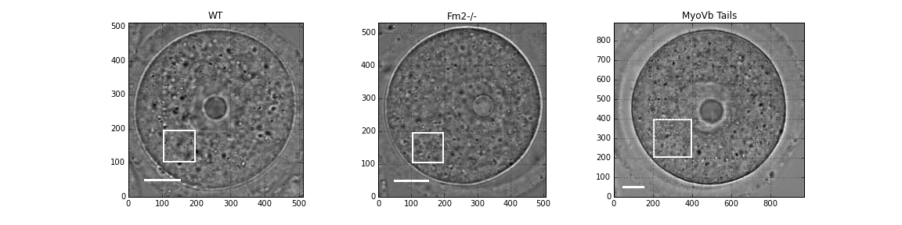

Active cytoplasm movement in mouse oocytes
##########################################
.. 1

Introduction
************
.. 2

Mouse oocyte are big spherical cells with a diameter of about 80 µm.  Previous work has shown
that the spindle positioning during meiotic cell division in oocytes depends 
on an actin meshwork that is present in the cell's cytoplasm :cite:`Schuh2008`.  This
actin meshwork is regulated by formin that is localized to endogenous vesicles. 
Additionally, these vesicles recruit the myosin-Vb motor protein, that are know do drive the active movement
of the vesicles in the cytoplasm :cite:`Holubcova2013`. In a collaborative project with the group of Marie-Hélène Verhlac
and her Postdoc Maria Almonacid at the Collège de France, we designed a way to measure
cytoplasmic activity in mouse oocyte.

In :num:`Figure #oocytewt` a typical mouse
oocyte is presented where the nucleus can be seen to be positioned at the center of the cell.
Current questions in this system relate to the mechanical processes during meiosis such as the chromosome migration, 
the assymetric cell division and the positioning of organelles by the dynamic remodelling of the actin network. 
While our team did active and passive microrheology measurements on the timescales or 10 seconds, I developed a 
method that is suitable for longer timescales in the order of minutes, that are more relevant for the process of meiosis. 

.. todo:

    Maybe mention that actin is important in this positioning.

.. _oocytewt:

.. figure:: figs/oocyte-wild-type.png     
    :alt: "Bright field image of an oocyte"
    :width: 60%

    Bright field image of a mouse oocyte before meiosis (scale bar is 20 µm).
    The cell diameter is about 80µm. The nucleus is positioned at the center of
    the oocyte during Meiosis I by the help of the actin network. The
    positioning is a crucial factor for the normal division of the oocyte. The
    oocytes are a good reference system as they provide a clean spherical
    symmetry and due to their size give a good spatial differences between the
    cortex and the cytosol which helps in measuring spatial variations of
    mechanical properties and vesicle movement.  Image Credit to Maria
    Almonacid from Collège de France.

Oocytes
*******
.. 2

The cytosolic actin meshwork in oocyte is controlled by the activity of formins (Fmn2) that
nucleate actin polymerisation and by the activity of the vesicle bound molecular motor protein myosins Vb that 
controls the dynamic movement of the
vesicles in the actin meshwork. Hence it is of interest to study oocytes that have formin and myosin Vb deficits. 
In particular, we focused on three types: 1) Wild types oocyte, 2) oocytes prepared from Formin 2 invalidated female 
(Fnm2-/-) that lack the
actin meshwork and 3) oocytes injected  with the dominant-negative tail of Myosin
Vb (:num:`Fig #fig3oo`)

.. _fig3oo:

    Bright field image microscopy of the 3 kinds of oocyte (Credit to Maria
    Almonacid, Collège de France). WT) Image of Wild Type Oocyte, Scale bar is
    20µm. Fmn2-/-) Oocytes extracted from females with invalidated Formin 2,
    theses oocytes lack the actin meshwork. MyosinVb Tails) Oocyte injected
    with a Myosin Vb dominant negative tail have a less actin vesicle
    population. The white square gives an example of the region that is used for the analysis presented in this chapter. 

Measure of activity
*******************
.. 2

The diffusive like motion of actin positive vesicles that can be observed during oocyte meiosis is
reduced in Fmn2-/- and MyosinVb-tails oocytes when compared to the wild type.
While the use of particle tracking algorithms to measure vesicle motion in oocyte is possible, it remains a
complex process especially as the vesicles may move outside the focal
plane of the microscope. As a simple approach to measure the vesicle activity we decided to
investigate the temporal variations of the bright field images in mouse oocyte.

We can compute the time dependent difference between predefined region of interest (ROI) in an image
series to see how fast the bright field images change. We can compare
the result for wild type, Formin Knockout and MyosinVb dominant negative tail (:num:`Fig #decay-all`).

.. _decay-all:
.. figure:: figs/decay-all.png
    :width: 80%

    Bright field images of 3 types of mouse oocyte : Wild type in first column,
    Formin knockout in second, Myosin Tails dominant negative in third. Row 1
    to 3 represent the region of interest of :num:`figure #fig3oo` (20 µm side)
    for each kind of oocyte. Row 1 show region of interest at t=0s, row 2 at
    t=1min and row 3 at t=10min. The color-coded difference between images at
    t=0s and 60s are shown on row 4, and between t=0s and 10min row 6. Blue
    indicate that the later image is brighter that the original one and red
    indicate that it is darker. For wild type oocyte, the difference of images
    reach rapidly its maximum value (Image J and M similar), Whereas for
    Fmn2-/- and MyoVb the difference between images separated by 60 seconds
    (K,L) is much smaller than after 10 minutes (N,O) which can be seen as the
    (K) is whiter than (N) and (L) is whiter than (O). The change in cytoplasm
    is thus much faster in WT oocyte (:math:`< min`) while it takes
    significantly longer in Fmn2-/- and MyosinVb oocytes.

To get a quantitative measurement of the speed at which the difference of the
images changes, we can compute the autocorrelation of bright field images
thought time. The correlation of two images :math:`A` and :math:`B` of same
dimension is defined as :

.. math::

    r_{AB}=\frac{\sum\limits_{i=1}^n (A_i-\bar{A})(B_i-\bar{B})}{(n-1) s_A s_B}

    
In which :math:`A_i` and :math:`B_i` are luminosity values of each of the
:math:`n` pixels of the images,  :math:`\bar{A},\bar{B}` corresponds to average
luminosity values over the images, :math:`s_A` and :math:`s_B` are the standard
deviations of the luminosity values. The correlation will give us a single
value that characterise the similarity of the images. A correlation of
:math:`1` mean the images are identical, a correlation of `0`, mean that the
images have nothing in common, a negative value of correlation mean that the
second image is globally dark where the first one is bright and bright when the
first one is dark. We can thus obtain a measurement of similarity of images
over time, that should start at :math:`1` for :math:`\Delta t=0s` between
images. We expect it to decrease until it eventually reaches zero. 

We can compare the decrease of correlation over time depending on the type of
oocyte. In order to extract a single value that represent the activity, we can
phenomenologically fit the correlation as a decaying exponential with an offset
:

.. math:: 
    :label: edecay

    r(t) = (1-off).e^{(-t/\tau)}+off

In which :math:`t` is time, and :math:`\tau` is a characteristic time
representing the correlation decay. The offset  :math:`off` represent the value
of the correlation at infinite time to take into account artifact in the chosen
region of interest, and defects in the image that will not decorrelate over
time. 

:num:`Figure  #fig-exp-decay` gives typical examples of the result of the
measured autocorrelation over time, and a single exponential decay fit. 

.. _fig-exp-decay:
.. figure:: figs/corrtime.png
    :width: 65%

    Decreasing autocorrelation of images intensity (solid line) over time, with
    exponential decay fit (dotted lines) as in :eq:`edecay`. The characteristic decay time of the fit 
    :math:`\tau` in the legend. We can see in the plot that the
    correlation of the images decrease much faster in wild type oocyte (red
    curves, :math:`\tau \sim minute`) in compared to Fmn2-/- (blue lines
    :math:`\tau > hour`) that lack the actin meshwork, or to dominant negative myosin Vb
    tails (green :math:`\tau > hour`). While the fit quality is not impressively good, the 
    overall change in the timescales is well captured. 

The results show that the values of the characteristic time increases with when
we disrupt the actin network or the  source of its dynamism by inactivating
Myosin Vb. We can then use the inverse of :math:`\tau` as an indicator of
activity.

Once we have define the activity of a region of the cytoplasm of the cell, we
can repeat the measurement on different areas of the cytoplasm. This allows to
reproduce a map of the activity in the cell as a function of the position (
:num:`Fig #fig-activity-map`.

.. _fig-activity-map:
.. figure:: figs/CellAct-WT.png
    :width: 95%

    Activity for different region of  10 by 10 pixels of a wild type oocyte.
    Value of :math:`1/\tau` plotted as color square overlaying the
    analysed bright field image. Scale
    bar is 20 µm. We can see that the activity is near the nucleus is lower
    (blue) than in the middle of the cytoplasm. 

The measure of the correlation characteristic decay time can also be done on a
time sliding widows. This allows for the determination of activity of a
particular area of the cytoplasm with time.

Conclusion
**********
.. 2

In this part we developed a methods that allow to determine the cytoplasmic
activity in oocytes by a noninvasive image analysis. This method also allows 
to determine the spatial and temporal variation of this cytoplasmic
activity. A further advantage of this methods is its flexibility regarding the timescales 
that are probed reaching from the second up to hours, noting that this is similar to the 
relevant timescale for oocyte maturation. Such long timescales are also
complementary to techniques like active optical tweezer based micro-rheology that have difficulties probing
timescale beyond tens of seconds due to thermal drift and cell movement, but
reach on the other hand much shorter timescales below ms.

The proposed techinque is currently actively applied by Marie-Hélène Verhlac and Maria Almonacid at the Collège de France. 
It is used to measure the activity
of actin networks in oocyte and determine their effect on the meiosis of mouse
oocyte and the organelle positioning. 

