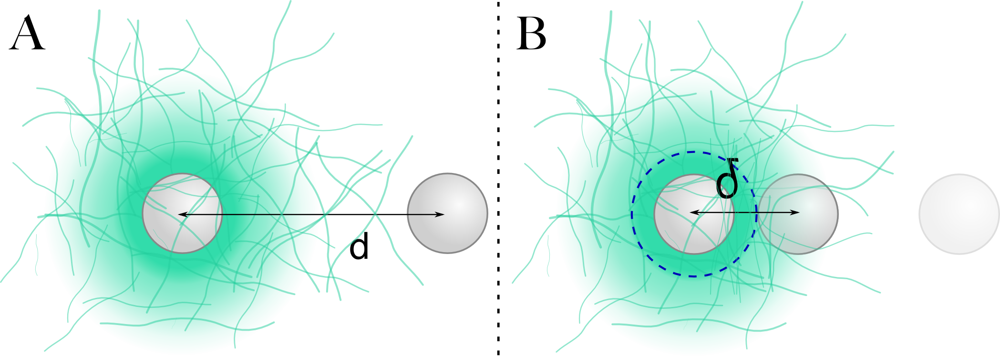

Résumé
######
.. 1

Les cellules sont considérées comme l'élément élémentaire de tous les êtres
vivants. Les propriétés mécaniques de ces cellules sont des paramètres cruciaux
qui permettent aux cellules d'effectuer ses fonctions, de se diviser, de
permettre à l'organisme dont elle fait partie de survivre. L'un des composant
clés qui donnent aux cellules leurs rigidités, et autres propriétés mécaniques
qui permettent aux cellules de se déplacer, de se diviser et de remplir leur
fonction est le cortex d'actine. L'actine est une protéine monomérique qui
s'autoassemble afin de former des filaments allant jusqu'à des longueurs de
plusieurs micromètres. À l'aide de protéine associée, l'actine est capable de
former un grand nombre de réseaux aux propriétés variables. C'est sur les
propriétés mécaniques de ce genre de réseau que je me suis concentré, afin de
mieux comprendre la structure et les propriétés que ces réseaux confèrent aux
cellules. 

Dans la première partie de me thèse je me suis concentré sur la reconstitution
de réseau d'actine `in vitro`, en particulier la reconstitution du cortex
d'actine. Le cortex d'actine est une fine couche de réseau branché d'actine que
l'on retrouve juste en dessous de la membrane cellulaire. La reconstitution du
cortex d'actine peut se faire sur des billes de polystyrène micrométrique
recouvert d'un activateur d'une protéine appelée Arp2/3. Arp2/3 se fixe sur les
filaments d'actine existant et nucléé une branche fille. Ceci est à l'origine
du réseau branché. Dans les bonnes conditions, en particulier en présence de
Protéine de Coiffe capable d'inhiber la croissance des filaments d'actine par
leur bout barbé, la croissance de ces gels sur les systèmes de bille est un bon
modèle représentant des réseaux trouvés au sein des cellules. 

À l'aide de pince optique, et en utilisant une bille à la surface passivée pour
sonder les environs du cortex d'actine reconstitué `in vitro` nous avons pu
montré l'existence d'une structure clairsemée d'actine aux propriétés
mécaniques bien distincte du cortex précédemment vu par fluorescence. Cette
structure que nous appelons « Nuage d'actine » est bien plus molle que le
cortex jusqu'alors vu sur la surface des billes (~1Pa au lieu de ~1kPa), mais
s'étend sur des distances bien plus importantes, jusqu'à une dizaine de
micromètres alors que le cortex jusqu'alors mesuré a une épaisseur
submicrométrique (:num:`Figure #fig-schem-delta`).  

.. _fig-schem-delta:

    Schéma représentant le réseau d'actine reconstitué sur un système
    biomimétique à base de bille ainsi que la méthode de mesure utilisée.  Un
    réseau d'actine est reconstitué sur une bille micrométrique (A, Sphère de
    gauche), et une bille à la surface passivée sert de sonde (A, Sphère de
    droite). La bille sonde va être utilisée pour compresser le ressaut d'actine
    compris entre les surfaces des deux sphères; et de déreminer ses propriétés
    mécaniques. 

En utilisant la théorie des polymères existante, nous arrivons à expliquer les
propriétés mécaniques de ces gels d'actine par leur structure clairsemée et de
la distance caractéristique d'enchevêtrements entre filaments.  La présence
d'un tel réseau sur des systèmes biomimétique indique leur probable présence
dans les cellules. Cette présence est confirmée par des observations `in vivo`
où le positionnement des organelles de cellules dépend de structure d'actine
similaire. L'utilisation du système de bille peut donc servir à la
reconstitution de ce nuage d'actine afin de mieux en comprendre ces
caractéristiques et son effet au sein des cellules.

Une publication détaillant les découvertes faites sur ce nuage d'actine à été
accepté pour publication dans « Biophysical Journal » sous la référence
`2014BIOPHYSJ303916R` avec le titre `Mechanical detection of a long range actin
network emanating from a biomimetic cortex`.

Dans une seconde partie, en collaboration avec J.Lemière et K.Carvalho, nous
développons un système biomimétique permettant la mesure de l'accroissement de
la tension cortical d'un cortex d'acto-myosine reconstitué. Notre système se
base sur la formation de doublet de liposomes. Sur ces doublets de liposomes
est déposée une couche d'actine filamenteuse imitant un cortex d'actine.
L'adjonction de minifilaments de myosine II déclenche l'augmentation de la
tension corticale. L'augmentation de cette tension corticale eut être mesurée
en fonction du temps à l'aide le la mesure des paramètres géométriques des
doublets.  En particulier, un des paramètres géométriques qui nous intéresse
est l'angle de contact formé entre les liposomes en contact. Afin d'avoir une
mesure robuste et automatisée de cet angle de contact, nous développons une
technique d'analyse automatisée des données basée sur l'ajustement d'un modèle
numérique rapide, sur des piles d'images acquises à l'aide d'un microscope
confocal. Ceci nous permet pour la première fois d'observer et d'obtenir une
mesure quantitative de l'accroissement de tension d'un cortex d'acto-myosine
avec le temps, ce qui devrait permettre une meilleure compréhension des
mécanismes induit par les moteurs moléculaires de l'actine dans les cellules.

Dans une troisième partie, lors d'une collaboration avec Marie-Hélène Verlhac
et une de ses Post-Doctorante du Collège de France, Maria Almonacid, nous nous
sommes intéressé au positionnement des organelles d'oocytes de souris. Les
oocytes de souris sont les cellules haploïdes germinales de souris, qui une
fois fécondée par les gamètes mâles donne naissance à l'embryon. Le
positionnement des organelles lors de la division asymétrique des gamètes
femelles est important pour le caractère haploïde des cellules sans quoi le
futur embryon serait non viable. Dans le cas d’oocytes de souris, le
positionnement du noyau en particulier, et extrêmement dépendant des
caractéristiques et du dynamisme d'un réseau d'actine présent au sein de la
cellule. Une caractérisation spatiale et temporelle de l'activité de ce réseau
est importante afin de comprendre l'effet de l'activité sur les différente
phases de la division méiotique donnant naissance à la cellule haploïde. C'est
dans ce cadre que nous avons développé une méthode complémentaire de mesure de
l'activité dans le cytoplasme. En utilisant une mesure de l'autocorrélation
des images acquises en microscopie en champ clair, nous sommes capables de
remonter à un temps caractéristique de décroissances de la valeur
d'autocorrélation. Ce temps caractéristique semble directement lié à
l'activité et la présence du réseau d'actine de la cellule. Cette méthode a
donc été utilisé pour mesuré spatialement et temporellement les variations de
l'activité au sein du cytoplasme d'oocyte de souris, et de comprendre l'effet
sur le positionnement des organelles lors de la division méiotique de ces
oocytes.

